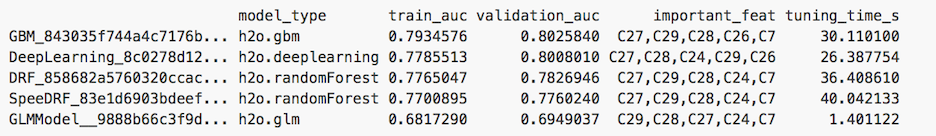

# Higgs Particle Discovery with H2O Deep Learning

######This tutorial shows how H2O can be used to classify particle detector events into Higgs bosons vs background noise. This file is both valid R and markdown code.
#####
### HIGGS dataset and Deep Learning
######We use (a subset of) the [UCI HIGGS](https://archive.ics.uci.edu/ml/datasets/HIGGS/) dataset with 11 million events and 28 features (21 low-level features and 7 humanly created non-linear derived features). In this tutorial, we show that (only) Deep Learning can automatically generate these or similar high-level features on its own and reach highest accuracies from just the low-level features alone, outperforming traditional classifiers. This is in accordance with a recently published Nature paper on using [Deep Learning for Higgs particle detection](http://www.slideshare.net/0xdata/how-to-win-data-science-competitions-with-deep-learning/33). Remarkably, Deep Learning also won the [Higgs Kaggle challenge](https://www.kaggle.com/c/higgs-boson/forums/t/10425/code-release) on the full set of features.

### Start H2O, import the HIGGS data, and prepare train/validation/test splits

######Initialize the H2O server (enable all cores)

    library(h2o)
    h2oServer <- h2o.init(nthreads=-1)
 

###### Import the data: For simplicity, we use a reduced dataset containing the first 100k rows.

    homedir <- paste0(path.expand("~"),"/Higgs/") #modify if needed
    TRAIN = "higgs.100k.csv.gz"
    data_hex <- h2o.importFile(h2oServer, path = paste0(homedir,TRAIN), header = F, sep = ',', key = 'data_hex')

###### Prepare train/validation/test splits: We split the dataset randomly into 3 pieces. Grid search for hyperparameter tuning and model selection will be done on the training and validation sets, and final model testing is done on the test set. We also assign the resulting frames to meaningful names in the H2O key-value store for later use, and clean up all temporaries at the end.

    random <- h2o.runif(data_hex, seed = 123456789)
    train_hex <- h2o.assign(data_hex[random < .8,], "train_hex")
    valid_hex <- h2o.assign(data_hex[random >= .8 & random < .9,], "valid_hex")
    test_hex  <- h2o.assign(data_hex[random >= .9,], "test_hex")
    h2o.rm(h2oServer, grep(pattern = "Last.value", x = h2o.ls(h2oServer)$Key, value = TRUE))
 
######The first column is the response label (background:0 or higgs:1). Of the 28 numerical features, the first 21 are low-level detector features and the last 7 are high-level humanly derived features (physics formulae).
  
    response = 1
    low_level_predictors = c(2:22)
    low_and_high_level_predictors = c(2:29)

### Establishing the baseline performance reference with several H2O classifiers
######To get a feel for the performance of different classifiers on this dataset, we build a variety of different H2O models (Generalized Linear Model, Random Forest, Gradient Boosted Machines and DeepLearning). We would like to use grid-search for hyper-parameter tuning with N-fold cross-validation, and we want to do this twice: once using just the low-level features, and once using both low- and high-level features.

######First, we source a few helper functions that allow us to quickly compare a multitude of binomial classification models, in particular the h2o.fit() and h2o.leaderBoard() functions.  Note that these specific functions require variable importances and N-fold cross-validation to be enabled.

    source("../helper.R") 

######The code below trains 60 models (2 loops, 5 classifiers with 2 grid search models each, each resulting in 1 full training and 2 cross-validation models). A leaderboard scoring the best models per h2o.fit() function is displayed.

    N_FOLDS=2
    
    best_model <- list()
    for (preds in list(low_level_predictors, low_and_high_level_predictors)) {
      data = list(x=preds, y=response, train=train_hex, valid=valid_hex, nfolds=N_FOLDS)
      
      models <- c(
        h2o.fit(h2o.glm, data, 
                list(family="binomial", variable_importances=T, lambda=c(1e-5,1e-4), use_all_factor_levels=T)),
        h2o.fit(h2o.randomForest, data, 
                list(type="fast", importance=TRUE, ntree=c(20), depth=c(10,15))),
        h2o.fit(h2o.randomForest, data, 
                list(type="BigData", importance=TRUE, ntree=c(20), depth=c(10,15))),
        h2o.fit(h2o.gbm, data, 
                list(importance=TRUE, n.tree=c(50), interaction.depth=c(5,10))),
        h2o.fit(h2o.deeplearning, data, 
                list(variable_importances=T, l1=c(1e-5), epochs=10, hidden=list(c(20,20,20), c(100,100))))
      )
      best_model <- list(best_model, h2o.leaderBoard(models, test_hex, response))
      h2o.rm(h2oServer, grep(pattern = "Last.value", x = h2o.ls(h2oServer)$Key, value = TRUE))
    }
    
###### The output contains a leaderboard for the models using low-level features only:
    
######    

###### The leaderboard and AUC values change when using both low- and high-level features:
  
######

###### Clearly, the high-level features add a lot of predictive power, but what if they are not easily available? On this sampled dataset and with simple models, Deep Learning seems to have an edge over the other methods when using low-level features only, indicating that it is able to create useful high-level features on its own.

###### *Note:* Every run of DeepLearning results in different results since we use [Hogwild!](http://www.eecs.berkeley.edu/~brecht/papers/hogwildTR.pdf) parallelization with intentional race conditions between threads.  To get reproducible results at the expense of speed for small datasets, set reproducible=T and specify a seed.

### Build an improved Deep Learning model on the low-level features alone
###### With slightly modified parameters, it is possible to build an even better Deep Learning model. We add dropout/L1/L2 regularization and increase the number of neurons and the number of hidden layers. Note that we don't use input layer dropout, as there are only 21 features, all of which are assumed to be present and important for particle detection. We also reduce the amount of dropout for derived features. Note that the importance of regularization typically goes down with increasing dataset sizes, as overfitting is less an issue when the model is small compared to the data.
    
    h2o.deeplearning(x=low_level_predictors, y=response, activation="RectifierWithDropout", data=train_hex, 
                     validation=valid_hex, input_dropout_ratio=0, hidden_dropout_ratios=c(0.2,0.1,0.1,0),
                     l1=1e-5, l2=1e-5, epochs=20, hidden=c(200,200,200,200))
   
###### With this computationally slightly more expensive Deep Learning model, we achieve training/validation AUCs of around 0.78/0.72, a nice boost over the simple models above.
    
#####`AUC =  0.7830957 (on train)`
#####`AUC =  0.7245833 (on validation)`    

###Voila!
#####We were able to show that H2O Deep Learning can create great models where automatic non-linear derived feature generation is required.

######Please note that this tutorial was on a small subsample (<1%) of the original dataset, and results do not trivially extend to the full dataset. Previous results by H2O Deep Learning on the full dataset (training on 10M rows, validation on 500k rows, testing on 500k rows) agree with a recently published Nature paper on using [Deep Learning for Higgs particle detection](http://www.slideshare.net/0xdata/how-to-win-data-science-competitions-with-deep-learning/33), where 5-layer H2O Deep Learning models have achieved a test set AUC value of 0.869. We would love to hear about your best models!

#### More information can be found in the [H2O Deep Learning booklet](https://t.co/kWzyFMGJ2S) and in our [slides](http://www.slideshare.net/0xdata/presentations).

### Appendix: Helper code
#####For those interested, here's the helper code to facilitate model comparison from R:

    TOP_FEATURES = 5
    
    h2o.get_auc <- function(model, data, response) {
      pred <- h2o.predict(model, data)[,3]
      perf <- h2o.performance(pred, data[,response])
      perf@model$auc
    }
    
    h2o.varimp <- function(algo, model) {
      if (identical(algo, h2o.glm)) {
        varimp <- paste(names(sort(abs(model@model$coefficients), TRUE))[1:TOP_FEATURES], collapse = ",", sep = ",")
      } else if (identical(algo, h2o.randomForest) || identical(algo, h2o.deeplearning)) {
        varimp <- paste(names(sort(model@model$varimp[1,], TRUE))[1:TOP_FEATURES], collapse = ",", sep = ",")
      } else if (identical(algo, h2o.gbm)) {
        varimp <- paste(rownames(model@model$varimp)[1:TOP_FEATURES], collapse = ",", sep = ",")
      }
      varimp
    }
    
    h2o.validate <- function(t0, model, modeltype, validation, response, varimp) {
      elapsed_seconds <- as.numeric(Sys.time()) - as.numeric(t0)
      modelkey <- model@key
      type <- modeltype
      auc <- h2o.get_auc(model, validation, response)
      result <- list(list(model, modeltype, response, elapsed_seconds, auc, varimp))
      names(result) <- model@key
      return(result)
    }
    
    h2o.fit <- function(algo, data, args) {
      t0 <- Sys.time()
      predictors <- data$x
      response <- data$y
      train <- data$train
      valid <- data$valid
      nfolds <- data$nfolds
      if (nfolds >= 0) {
        model <- do.call(algo, modifyList(list(x=predictors, y=response, data=train, nfolds=nfolds), args))
      } else {
        model <- do.call(algo, modifyList(list(x=predictors, y=response, data=train), args))
      }
      if (.hasSlot(model,"sumtable")) {
        model <- model@model[[1]]
      }
      return(h2o.validate(t0, model, as.character(substitute(algo)), valid, response, h2o.varimp(algo, model)))
    }
    
    h2o.selectModel <- function(x) {
      c(model_key = x[[1]]@key,
        model_type = x[[2]],
        train_auc = as.numeric(x[[1]]@model$auc),
        validation_auc = as.numeric(x[[5]]),
        important_feat = x[[6]],
        tuning_time_s = as.numeric(as.character(x[[4]])))
    }
    
    h2o.leaderBoard <- function(models, test_hex, response) {
      model.list <- as.data.frame(t(as.data.frame(lapply(models, h2o.selectModel))))
      model.list$train_auc <- as.numeric(as.character(model.list$train_auc))
      model.list$validation_auc <- as.numeric(as.character(model.list$validation_auc))
      
      #### sort the models by AUC from worst to best
      models.sort.by.auc <- model.list[with(model.list, order(validation_auc)),-1]
      models.sort.by.auc <- models.sort.by.auc[rev(rownames(models.sort.by.auc)),]
    
      #### convert the `auc` and `tuning_time` columns into numerics
      models.sort.by.auc$train_auc       <- as.numeric(as.character(models.sort.by.auc$train_auc))
      models.sort.by.auc$validation_auc  <- as.numeric(as.character(models.sort.by.auc$validation_auc))
      models.sort.by.auc$tuning_time_s   <- as.numeric(as.character(models.sort.by.auc$tuning_time_s))
      
      #### display the frame
      print(models.sort.by.auc)
      
      #### score the best model on the test data
      best_model <- h2o.getModel(h2oServer, rownames(models.sort.by.auc)[1])
      preds <- h2o.predict(best_model, test_hex)
      test_auc <- h2o.get_auc(best_model, test_hex, response)
      
      cat(paste(" -------------------------------\n",
                "Best Model Performance On Final Testing Data:", "\n",
                "AUC = ", round(test_auc,6), "\n",
                "--------------------------------\n"))
      
      cat(paste(" =---------Summary------------=\n",
                "Best model type: ", models.sort.by.auc[1,]$model_type, "\n",
                "Best model AUC on test: ", round(test_auc,6), "\n",
                "Top", TOP_FEATURES, "important features: ", models.sort.by.auc[1,]$important_feat, "\n",
                "Model training time (incl. tuning, grid search): ", round(models.sort.by.auc[1,]$tuning_time_s,6), "seconds \n",
                "Training data rows: ", nrow(train_hex), "\n",
                "Training data cols: ", ncol(train_hex), "\n",
                "Validation data rows: ", nrow(valid_hex), "\n",
                "=----------------------------=\n"))
      best_model
    }

