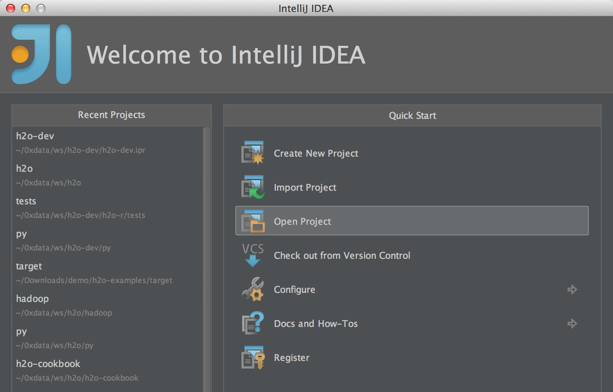
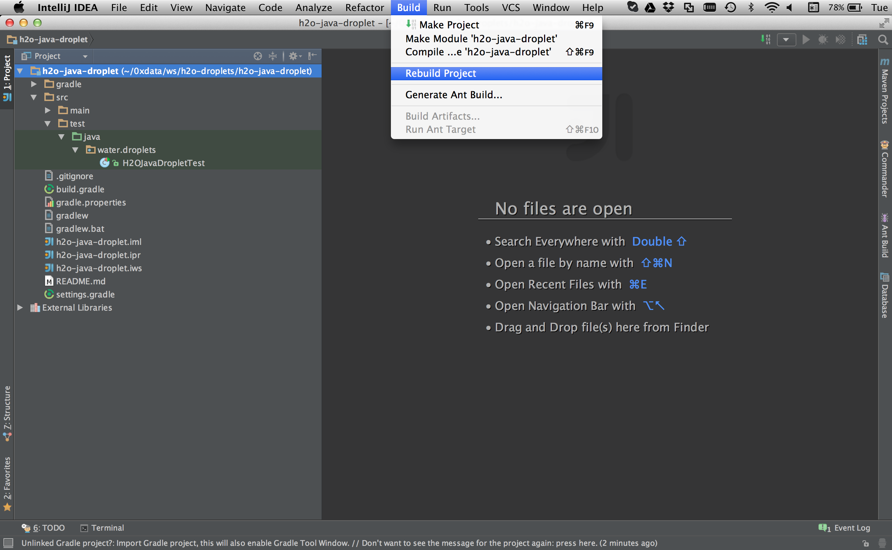
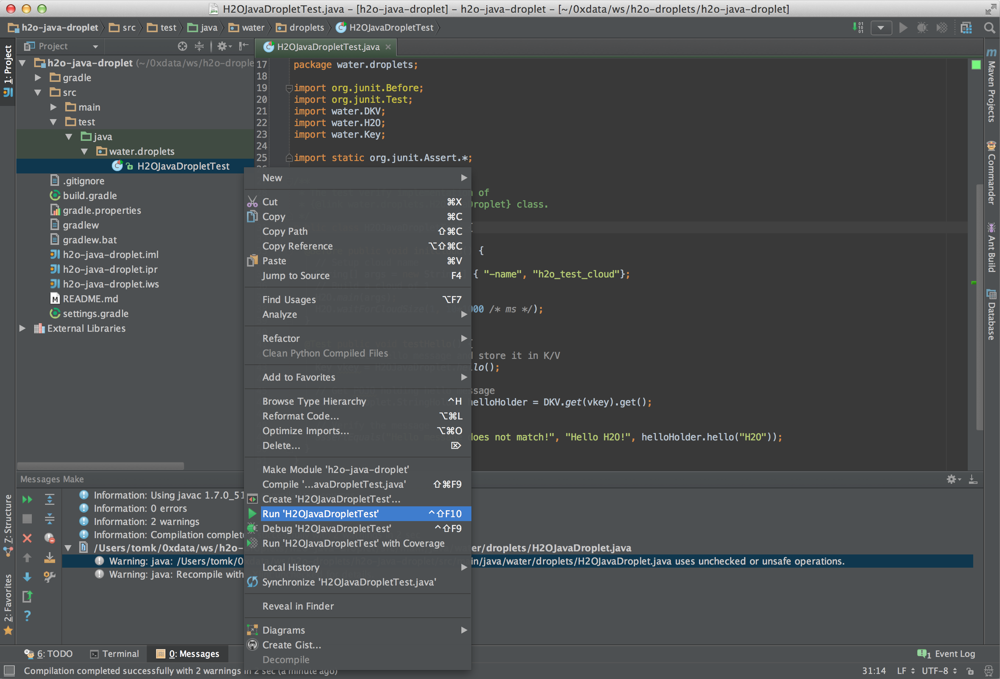
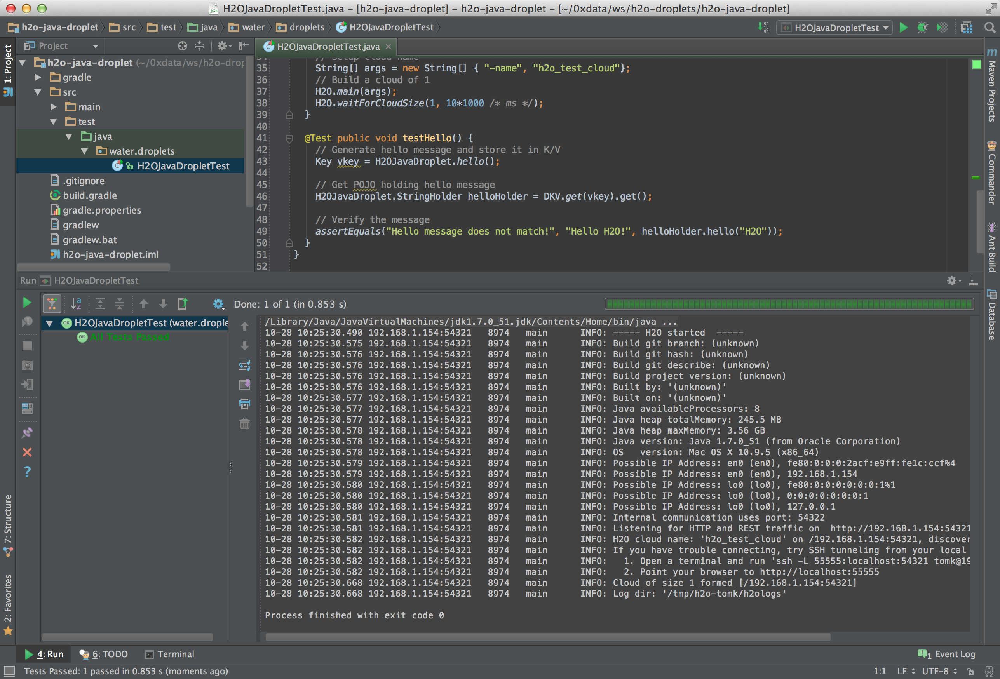

# Start Developing Your Application On Top of H<sub>2</sub>O-dev

>This tutorial targets developers who are trying to build application on top of the [h2o-dev](https://github.com/0xdata/h2o-dev) repository. 
>It will walk you through a quick introduction of _H<sub>2</sub>O droplets_ - projects templates which can be used to build a new application.

## 1. Cloning the examples repository

The `h2o-droplets` repository on GitHub contains some very simple starter projects for different languages.  Let's get started by cloning the `h2o-droplets` repository, and changing to that directory.

`$ git clone https://github.com/0xdata/h2o-droplets.git`

```
Cloning into 'h2o-droplets'...
remote: Counting objects: 53, done.
remote: Compressing objects: 100% (33/33), done.
remote: Total 53 (delta 10), reused 39 (delta 0)
Unpacking objects: 100% (53/53), done.
Checking connectivity... done.
```

`$ cd h2o-droplets`

> Note: if you are using H<sub>2</sub>O training sandbox, the repository is already cloned for you in `~/devel/h2o-droplets`.

## 2. A quick look at the repo contents

As of this writing, the repository contains a Java example and a Scala example.  Each of these is an independent starter project.

`$ ls -al`

```
total 8
drwxr-xr-x   6 tomk  staff   204 Oct 28 08:40 .
drwxr-xr-x  35 tomk  staff  1190 Oct 28 08:40 ..
drwxr-xr-x  13 tomk  staff   442 Oct 28 08:40 .git
-rw-r--r--   1 tomk  staff   322 Oct 28 08:40 README.md
drwxr-xr-x  11 tomk  staff   374 Oct 28 08:40 h2o-java-droplet
drwxr-xr-x  11 tomk  staff   374 Oct 28 08:40 h2o-scala-droplet
```

Let's take a closer look at the Java example:

`$ find h2o-java-droplet -type f`

```
h2o-java-droplet/.gitignore
h2o-java-droplet/build.gradle
h2o-java-droplet/gradle/wrapper/gradle-wrapper.jar
h2o-java-droplet/gradle/wrapper/gradle-wrapper.properties
h2o-java-droplet/gradle.properties
h2o-java-droplet/gradlew
h2o-java-droplet/gradlew.bat
h2o-java-droplet/README.md
h2o-java-droplet/settings.gradle
h2o-java-droplet/src/main/java/water/droplets/H2OJavaDroplet.java
h2o-java-droplet/src/test/java/water/droplets/H2OJavaDropletTest.java
```

As you can see, the Java example contains of a `build.gradle` file, a Java source file, and a Java test file.

Look at the `build.gradle` file and you will see the following sections, which link the Java droplet sample project to a version of `h2o-dev` published in MavenCentral:

```groovy
repositories {
    mavenCentral()
}
```

```groovy
ext {
  h2oVersion = '0.1.8'
}
```

```groovy
dependencies {
    // Define dependency on core of H2O
    compile "ai.h2o:h2o-core:${h2oVersion}"
    // Define dependency on H2O algorithm 
    compile "ai.h2o:h2o-algos:${h2oVersion}"
    // Demands web support 
    compile "ai.h2o:h2o-web:${h2oVersion}"

    // H2O uses JUnit for testing 
    testCompile 'junit:junit:4.11'
}
```

This is all very standard Gradle stuff.  In particular, note that this example depends on three different H<sub>2</sub>O artifacts, all of which are built in the h2o-dev repository.  

* **_h2o-core_** contains base platform capabilities like H<sub>2</sub>O's in-memory distributed key/value store and mapreduce frameworks (the "water" package).
* **_h2o-algos_** contains math algorithms like GLM and Random Forest (the "hex" package).
* **_h2o-web_** contains the browser web UI (lots of javascript).


## 3. Preparing the example for use in your IDE

Let's walk through an example using IntelliJ IDEA.  The first step is to use Gradle to build your IntelliJ project file.

`$ cd h2o-java-droplet`  
`$ ./gradlew idea`

```
:ideaModule
Download http://repo1.maven.org/maven2/ai/h2o/h2o-core/0.1.8/h2o-core-0.1.8.pom
Download http://repo1.maven.org/maven2/ai/h2o/h2o-algos/0.1.8/h2o-algos-0.1.8.pom
Download http://repo1.maven.org/maven2/ai/h2o/h2o-web/0.1.8/h2o-web-0.1.8.pom
[... many more one-time downloads not shown ...]
:ideaProject
:ideaWorkspace
:idea

BUILD SUCCESSFUL

Total time: 51.429 secs
```

You will see three new files created with IDEA extensions.  The .ipr file is the project file.

`$ ls -al`

```
total 168
drwxr-xr-x  15 tomk  staff    510 Oct 28 10:03 .
drwxr-xr-x   6 tomk  staff    204 Oct 28 08:40 ..
-rw-r--r--   1 tomk  staff    273 Oct 28 08:40 .gitignore
drwxr-xr-x   3 tomk  staff    102 Oct 28 10:03 .gradle
-rw-r--r--   1 tomk  staff   1292 Oct 28 08:40 README.md
-rw-r--r--   1 tomk  staff   1409 Oct 28 08:40 build.gradle
drwxr-xr-x   3 tomk  staff    102 Oct 28 08:40 gradle
-rw-r--r--   1 tomk  staff     23 Oct 28 08:40 gradle.properties
-rwxr-xr-x   1 tomk  staff   5080 Oct 28 08:40 gradlew
-rw-r--r--   1 tomk  staff   2404 Oct 28 08:40 gradlew.bat
-rw-r--r--   1 tomk  staff  33316 Oct 28 10:03 h2o-java-droplet.iml
-rw-r--r--   1 tomk  staff   3716 Oct 28 10:03 h2o-java-droplet.ipr
-rw-r--r--   1 tomk  staff   9299 Oct 28 10:03 h2o-java-droplet.iws
-rw-r--r--   1 tomk  staff     39 Oct 28 08:40 settings.gradle
drwxr-xr-x   4 tomk  staff    136 Oct 28 08:40 src
```


## 4. Opening the project

  * Since we have already created the project file, start up IDEA and choose Open Project.

  </img>

  * Choose the **_h2o-java-droplet.ipr_** project file that we just created with gradle.

  </img>


## 5. Running the test inside the project

  * Rebuild the project.

  </img>

  * Run the test by right-clicking on the test name.

  </img>

  * Watch the test pass!

  </img>

