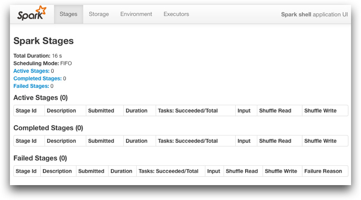
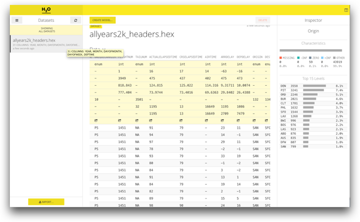
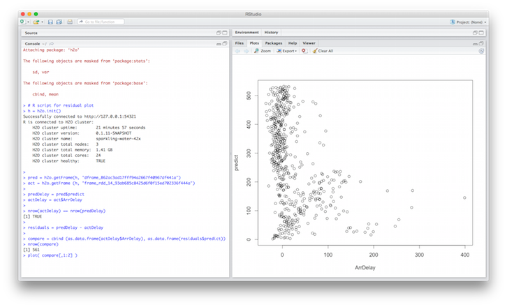

# Start with Sparkling Water

> This short tutorial introduces _Sparkling Water_ project 
enabling H<sub>2</sub>O platform execution on the top of Spark.

> The tutorial guides through project building and demonstrates
> capabilities of _Sparkling Water_ on the example using Spark Shell
> to build a Deep Learning model with help of H<sub>2</sub>O algorithms and Spark data wrangling. 


## Project Repository
The _Sparkling Water_ project is hosted on GitHub. 
You can clone it:

```
$ git clone https://github.com/0xdata/sparkling-water.git
$ cd sparkling-water
```

Or the repository is also already prepared on the provided H<sub>2</sub>O:
```
cd ~/devel/sparkling-water
```

## Build the Project
The provided top-level `gradlew` command is used for building:
```
$ ./gradlew build
```

The command produces an assembly artifact which can be
executed directly on the Spark platform.

## Run Sparkling Water

### Export location of your Spark distribution 

```
$ export SPARK_HOME=/opt/spark
```
> Note: The provided sandbox image already contains exported shell variable `SPARK_HOME`


### Run Sparkling Water
Start a Spark cluster with _Sparkling Water_:
```
bin/run-sparkling.sh
``` 

Go to [http://localhost:54321/steam/index.html](http://localhost:54321/steam/index.html) to access H<sub>2</sub>O web interface.

> Note: By default the command creates a Spark cluster specified by `local-cluster[3,2,1024]` Spark master address. Hence, the cluster contains 3 worker nodes, each has running H<sub>2</sub>O services.

### Run Sparkling Shell
Start Spark shell with _Sparkling Water_:
```
bin/sparkling-shell
```

> Note: The command launches regular Spark shell with H<sub>2</sub>O services. To access Spark UI go to [http://localhost:4040](http://localhost:4040), to access H<sub>2</sub>O web UI go to [http://localhost:54321/steam/index.html](http://localhost:54321/steam/index.html).

## Step-by-Step Example

1. Run Sparkling shell with an embedded cluster consisting of 3 Spark worker nodes:
  ```
  export MASTER="local-cluster[3,2,1024]"
  bin/sparkling-shell
  ```

2. You can go to [http://localhost:4040/](http://localhost:4040/) to see the Sparkling shell (i.e., Spark driver) status.

  

3. Create H<sub>2</sub>O cloud using all 3 Spark workers:
  ```scala
  import org.apache.spark.h2o._
  import org.apache.spark.examples.h2o._
  val h2oContext = new H2OContext(sc).start()
  import h2oContext._
  ```

4. Load weather data for Chicago international airport (ORD) with help of regular Spark RDD API:
  ```scala
  val weatherDataFile = "/data/h2o-training/sparkling-water/weather_ORD.csv"
  val wrawdata = sc.textFile(weatherDataFile,3).cache()
  // Parse and skip rows composed only of NAs
  val weatherTable = wrawdata.map(_.split(",")).map(row => WeatherParse(row)).filter(!_.isWrongRow())
  ```

5. Load and parse flight data using H<sub>2</sub>O API:
  ```scala
  import java.io.File
  val dataFile = "/data/h2o-training/sparkling-water/allyears2k_headers.csv.gz"
  // Load and parse using H2O parser
  val airlinesData = new DataFrame(new File(dataFile))
  ```

6. Go to [H<sub>2</sub>O web UI](http://localhost:54321/steam/index.html) and explore data:

  

7. Select flights with destination in Chicago (ORD) with help of Spark API:
  ```scala
  val airlinesTable : RDD[Airlines] = toRDD[Airlines](airlinesData)
  val flightsToORD = airlinesTable.filter(f => f.Dest==Some("ORD"))
  ```
  
8. Compute number of these flights:
  ```scala
  flightsToORD.count
  ```

9. Use Spark SQL to join flight data with weather data
  ```scala
  import org.apache.spark.sql.SQLContext
  val sqlContext = new SQLContext(sc)
  import sqlContext._
  flightsToORD.registerTempTable("FlightsToORD")
  weatherTable.registerTempTable("WeatherORD")
  ```

10. Perform SQL JOIN on both tables
  ```scala
  val bigTable = sql(
          """SELECT
            |f.Year,f.Month,f.DayofMonth,
            |f.CRSDepTime,f.CRSArrTime,f.CRSElapsedTime,
            |f.UniqueCarrier,f.FlightNum,f.TailNum,
            |f.Origin,f.Distance,
            |w.TmaxF,w.TminF,w.TmeanF,w.PrcpIn,w.SnowIn,w.CDD,w.HDD,w.GDD,
            |f.ArrDelay
            |FROM FlightsToORD f
            |JOIN WeatherORD w
            |ON f.Year=w.Year AND f.Month=w.Month AND f.DayofMonth=w.Day""".stripMargin)
  ```
  
11. Run deep learning to produce model estimating arrival delay:
  ```scala
  import hex.deeplearning.DeepLearning
  import hex.deeplearning.DeepLearningModel.DeepLearningParameters
  val dlParams = new DeepLearningParameters()
  dlParams._train = bigTable
  dlParams._response_column = 'ArrDelay
  dlParams._epochs = 100
  // Create a job  
  val dl = new DeepLearning(dlParams)
  val dlModel = dl.trainModel.get
  ```

12. Use model to estimate delay on training data
  ```scala
  val predictionH2OFrame = dlModel.score(bigTable)('predict)
  val predictionsFromModel = toRDD[DoubleHolder](predictionH2OFrame).collect.map(_.result.getOrElse(Double.NaN))
  ```
  
13. Generate a R-code to show residuals graph:
  ```scala
  println(s"""
  #
  # R script for residual plot
  #
  # Import H2O library
  library(h2o)
  # Initialize H2O R-client
  h = h2o.init()
  # Fetch prediction and actual data, use remembered keys
  pred = h2o.getFrame(h, "${predictionH2OFrame._key}")
  act = h2o.getFrame (h, "${rame_rdd_14_b429e8b43d2d8c02899ccb61b72c4e57}")
  # Select right columns
  predDelay = pred$$predict
  actDelay = act$$ArrDelay
  # Make sure that number of rows is same  
  nrow(actDelay) == nrow(predDelay)
  # Compute residuals  
  residuals = predDelay - actDelay
  # Plot residuals   
  compare = cbind (as.data.frame(actDelay$$ArrDelay), as.data.frame(residuals$$predict))
  nrow(compare)
  plot( compare[,1:2] )
  """)
  ```

14. Open RStudio and execute generated code:

  

  > Note: RStudio has to contain the newest H2O-DEV client library.


## More information
  * [_Sparkling Water_ GitHub](http://github.com/0xdata/sparkling-water)
  * [H<sub>2</sub>O YouTube Channel](https://www.youtube.com/user/0xdata)
  * [H<sub>2</sub>O SlideShare](http://www.slideshare.net/0xdata)
  * [H<sub>2</sub>O Blog](http://h2o.ai/blog)
  