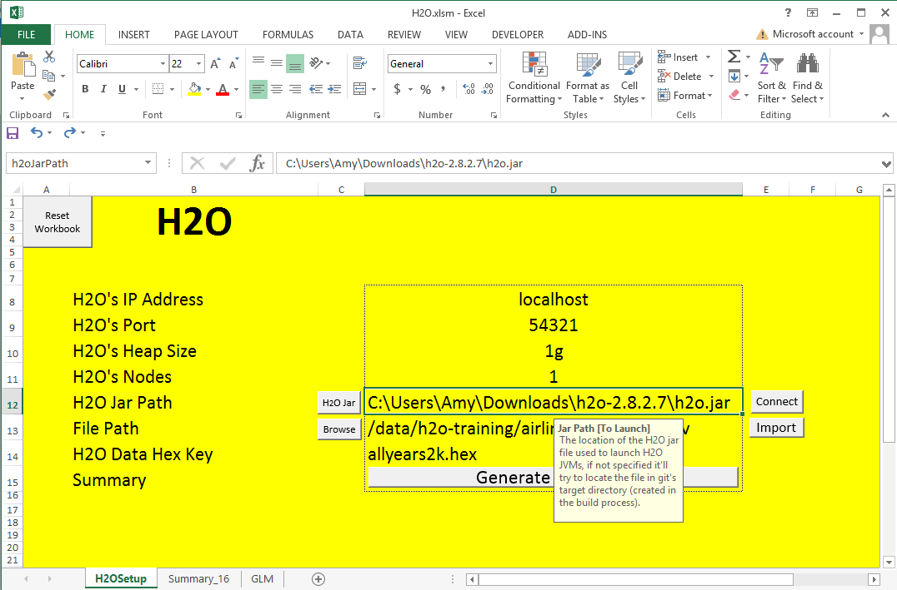
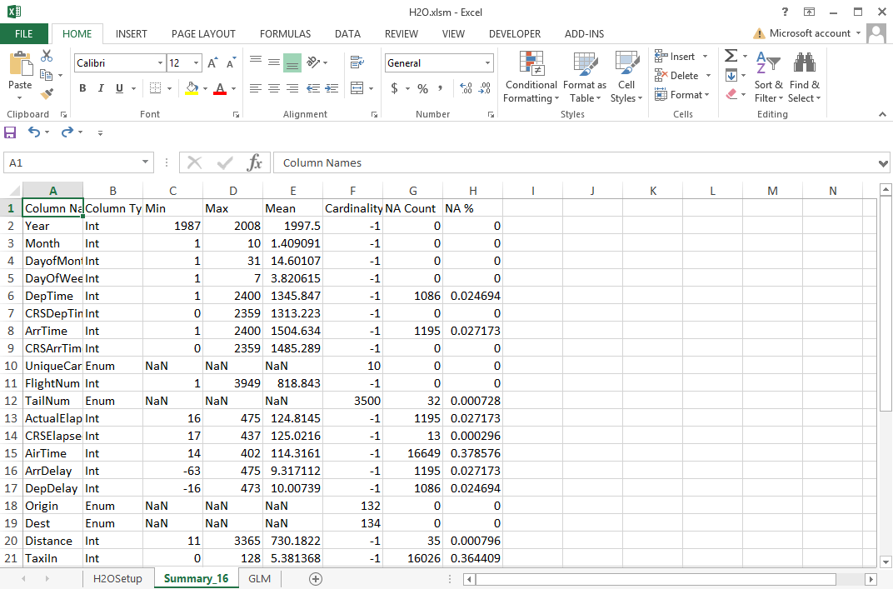
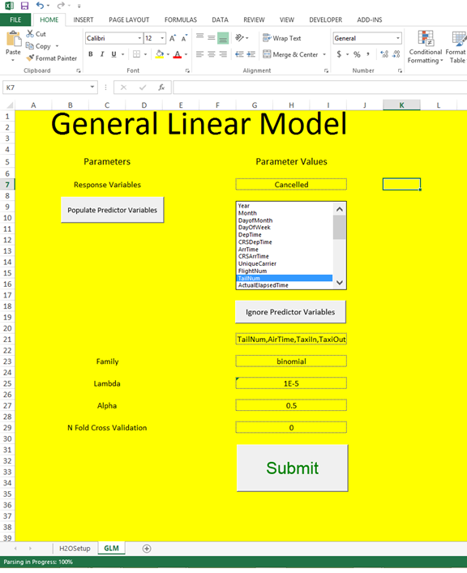
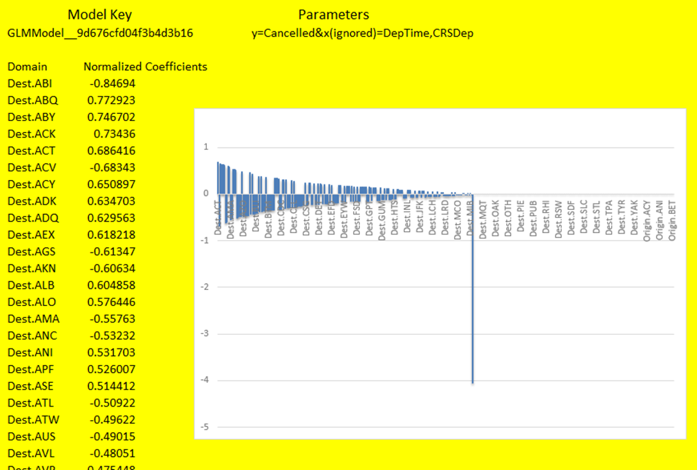

# Beauty and Big Data: Excel

## Using Excel with H2O

When working with Excel the HTTP call to H2O will elicit a response in XML format that Microsoft Excel can parse in both 32-bit and 64-bit version. For Excel users that are already familiar with excel features and functions, this tutorial will work you through some basic H2O capabilities written in VBA. So the demonstration Excel file has to be macro enabled to access all the point and click features.

### Initialization and Data Import

  * Start up a H2O session
  * Input for *IP Address*: 'localhost'
  * Input for *Port*: '54321'
  * Input for *Heap Size*: '1g'
  * Input for *Number of Nodes*: '1'
  * Input for *File Path*: '/data/h2o-training/airlines/allyears2k.csv'
  * Hit Submit to import the data with a progress bar in the lower left hand corner 
  * The entry “H2O Data Hex Key” should automatically fill in with the destination key of the hex file now sitting in H2O

### Data Summary

  * Hit *Generate Summary* to create a new worksheet with a summary of all the columns in the data set
  * All columns except “NA%” are taken directly from H2O’s inspect page 

### Build GLM Model

  * Input for *Response Variable*: 'IsDepDelayed'
  * Then hit “Populate Predictor Variables,” which will eliminate the response variable from the Predictor Variables as well as highlight the variables with high NA counts to ignore.
  * Input for **family**: 'binomial'
  * Fill in other information such as lambda, alpha, and the number of cross validation you want to run. 
  * Hit submit to start the model build

### Visualize Model Output
  * On the *Output Models* section, select a model you'll like to visualize
  * Hit *Show Output* to show the coefficients for the GLM model.
  * Create a bar chart and sort the coefficients by magnitude.

