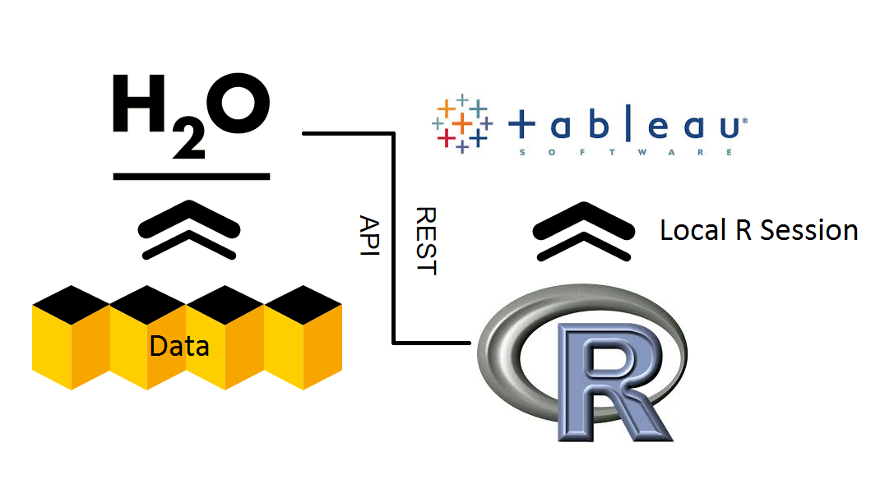

# Beauty and Big Data: Tableau

## Tableau

Download [Tableau](http://www.tableausoftware.com/) in order to use notebooks available on our [github](https://github.com/0xdata/h2o/tree/master/tableau).

### How does Tableau play with H2O?

Tableau is the frontend visual organizer that utilizes all the available statistic tools from open source R and H2O. Tableau will connect to R via a socket server using a library package already built for R. The H2O client package available for installation allows R to connect and communicate to H2O via a REST API. So by connecting Tableau to R, Tableau essentially can launch or initiate H2O and run any of the features already available for R.

</img>

### R Component

First, make sure to [install H<sub>2</sub>O](http://docs.0xdata.com/Ruser/Rinstall.html#r-installation) in R:

```
> install.packages("h2o")
```

Then install the Rserve package in R that will allow the user to start up a R session on a local server that Tableau will communicate with:

```
> install.packages("Rserve")
> library("Rserve")
> run.Rserve(port = 6311)
```

### Tableau Front End

  * **Step 1: Connection Setup**
  
	Open Demo_Template_8.1.twb which should have all the calculated fields containing R script already in the sidebar.

	Navigate to “Help > Settings and Performance > Manage R Connection” to establish a connection to the R serve.
	
	
	  
	Input for IP: 'localhost' and for port: '54321'

	

  * **Step 2: Data Connection**
  	
	Set the workbook’s connection to the airlines_meta.csv data by navigating to the data section on the left sidebar, right clicking on the airlines_meta and choosing to “Edit Connection.”

	

	
	

  * **Step 3: H2O Initialization**

	Configure the IP Address and Port that H2O will launch at as well as the path to the full airlines data file.

	
 
  * **Step 4: Data Import**

	
	
	Execute “00 Load H2O and Tableau functions” to run:

	```
	> library(h2o)
	> tableauFunctions <- functions(x){
	> ...
	> }
	> print('Finish loading necessary functions')
	```

	Execute “01 Init H2O & Parse Data” to:

	```
	> library(h2o)
	> localH2O = h2o.init(ip = "localhost", port = 54321, nthreads = -1)
	> data = h2o.importFile(localH2O, "/data/h2o-training/airlines/allyears2k.csv")
	```

	Execute “02 Compute Aggregation with H2O’s ddply” to groupby columns and do roll ups. First calculate the number of flights coming and going per month:
	```
	numFlights = ddply(data.hex, 'Month', nrow)
	numFlights.R = as.data.frame(numFlights)
	```
	
	Then compute the number of cancelled flights per month:

	```
	fun2 = function(df) {sum(df$Cancelled)}
	h2o.addFunction(h2oLocal, fun2)
	canFlights = ddply(data.hex, 'Month', fun2)
	canFlights.R = as.data.frame(canFlights)
	```
	
	Execute “03 Run GLM” to build a GLM model in H2O and grab back coefficient values that will be plotted in multiple worksheets:

	```
	data.glm = h2o.glm(x = c('Origin', 'Dest', 'Distance', 'Unique Carrier') , y = 'Cancelled', data = data.hex, family = 'binomial', nfolds = 0, standardize=TRUE)
	```

  * After the calculated fields finishes running, scroll through the different dashboards to see data differently.

	</img>
