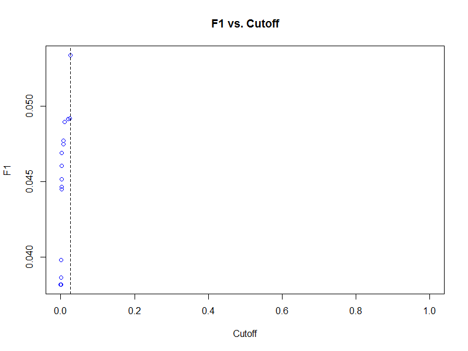
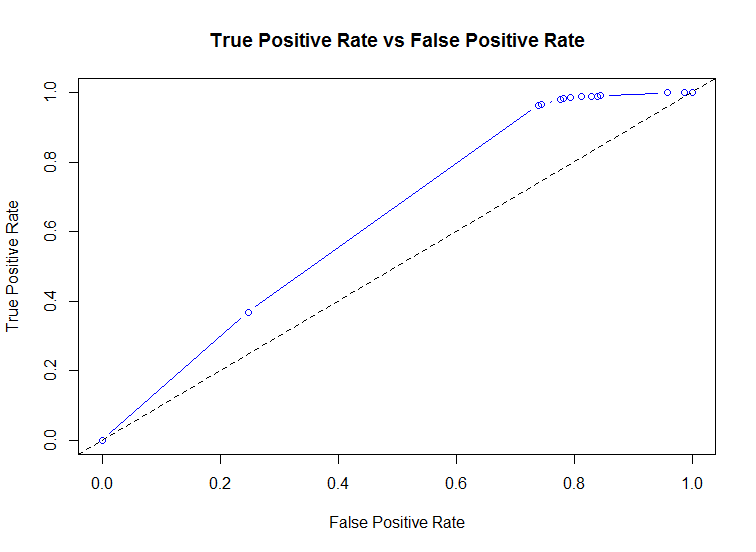
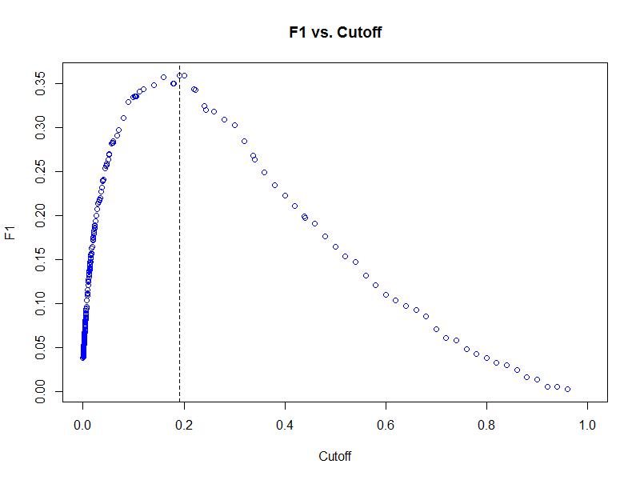
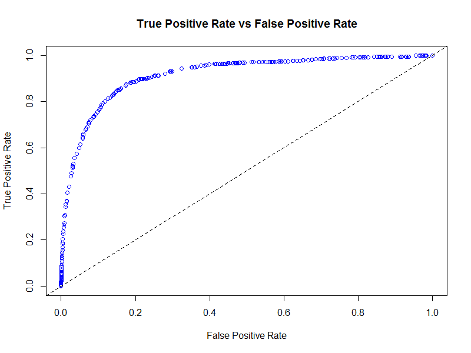

# Classification using Generalized Linear Models, Gradient Boosting Machines, and Random Forests in H2O

###### This tutorial demonstrates classification modeling in H2O using generalized linear models (GLM), gradient boosting machines (GBM), and random forests. It requires an installation of the h2o R package and its dependencies.

### Load the h2o R package and start an local H2O cluster

###### We will begin this tutorial by starting a local H2O cluster using the default heap size and as much compute as the operating system will allow.

    library(h2o)
    h2oServer <- h2o.init(nthreads = -1)

    rmLastValues <- function(pattern = "Last.value.")
    {
      keys <- h2o.ls(h2oServer, pattern = pattern)$Key
      if (!is.null(keys))
        h2o.rm(h2oServer, keys)
      invisible(keys)
    }

### Load the training and testing data into the H2O key-value store

###### This tutorial uses a 0.1% sample of the Person-Level 2013 Public Use Microdata Sample (PUMS) from United States Census Bureau with 75% of that sample being designated to the training data set and 25% to the test data set. This data set is intended to be an update to the [UCI Adult Data Set](https://archive.ics.uci.edu/ml/datasets/Adult).

    datadir <- "/data"
    pumsdir <- file.path(datadir, "h2o-training", "pums2013")
    trainfile <- "adult_2013_train.csv.gz"
    testfile  <- "adult_2013_test.csv.gz"
    adult_2013_train <- h2o.importFile(h2oServer,
                                       path = file.path(pumsdir, trainfile),
                                       key = "adult_2013_train", sep = ",")
    adult_2013_test <- h2o.importFile(h2oServer,
                                      path = file.path(pumsdir, testfile),
                                      key = "adult_2013_test", sep = ",")
    dim(adult_2013_train)
    dim(adult_2013_test)

###### For the purposes of validation, we will create a single column data set containing only the target variable `TOP2_WAGP` from the test data set.

    actual_top2_wagp <- h2o.assign(adult_2013_test[, "TOP2_WAGP"],
                                   key = "actual_top2_wagp")
    rmLastValues()

###### Also for our data set we have 8 columns that use integer codes to represent categorical levels so we will coerce them to factor after the data read.

    for (j in c("COW", "SCHL", "MAR", "INDP", "RELP", "RAC1P", "SEX", "POBP")) {
      adult_2013_train[[j]] <- as.factor(adult_2013_train[[j]])
      adult_2013_test[[j]]  <- as.factor(adult_2013_test[[j]])
    }
    rmLastValues()

### Fit a basic logistic regression model

    top2_wagp_glm_relp <- h2o.glm(x = "RELP", y = "TOP2_WAGP",
                                  data = adult_2013_train,
                                  key  = "top2_wagp_glm_relp",
                                  family = "binomial",
                                  lambda = 0)
    top2_wagp_glm_relp

### Generate performance metrics from a single model

###### We can create detailed performance metrics using the `h2o.performance` function that was inspired by the `performance` function from Tobias Sing's [ROCR](http://cran.r-project.org/web/packages/ROCR/index.html) package, which is hosted on the Comprehensive R Archive Network (CRAN).

##### Binary classifier performance metrics
###### $P$ is the total number of Positive values, $1$, in the binary target
###### $N$ is the total number of Negative values, $-1$ or $0$, in the binary target
###### $TP$ is the number of True Positives, i.e. predict positive when actually positive
###### $TN$ is the number of True Negatives, i.e. predict negative when actually negative
###### $FP$ is the number of False Positives, i.e. predict positive when acutally negative; also known as the Type I error
###### $FN$ is the number of False Negatives, i.e. predict negative when acutally positive; also known as the Type II error

###### $Recall\ (or\ Sensitivity\ or\ True\ Positive\ Rate) = \frac{TP}{P} = \frac{TP}{TP + FN}$
###### $Specificity\ (or\ True\ Negative\ Rate) = \frac{TN}{N} = \frac{TN}{FP + TN}$
###### $Precision\ (or\ Positive\ Predictive\ Value) = \frac{TP}{TP + FP}$
###### $False\ Discovery\ Rate\ = \frac{FP}{TP + FP} = 1 - Precision$
###### $Negative\ Predictive\ Value = \frac{TN}{TN + FN}$
###### $Fall-out\ (or\ False\ Positive\ Rate) = \frac{FP}{N} = \frac{FP}{FP + TN}$
###### $False\ Negative\ Rate = \frac{FN}{P} = \frac{FN}{TP + FN}$

###### $Accuracy = \frac{TP + TN}{P + N}$
###### $Misclassification\ Error = \frac{FP + FN}{P + N} = 1 - Accuracy$
###### $F1 = \frac{2}{\frac{1}{Precision} + \frac{1}{Recall}} = 2\frac{Precision * Recall}{Precision + Recall} = \frac{2TP}{2TP + FP + FN}$ (harmonic mean)
###### $Matthews\ Correlation\ Coefficient\ (MCC) = \frac{TP * TN - FP * FN}{\sqrt{(TP + FP)(TP + FN)(TN + FP)(TN + FN)}}$

    pred_top2_wagp_glm_relp <- h2o.predict(top2_wagp_glm_relp, adult_2013_test)
    pred_top2_wagp_glm_relp

    prob_top2_wagp_glm_relp <- h2o.assign(pred_top2_wagp_glm_relp[, 3L],
                                          key = "prob_top2_wagp_glm_relp")
    rmLastValues()

    f1_top2_wagp_glm_relp <- h2o.performance(prob_top2_wagp_glm_relp,
                                             actual_top2_wagp,
                                             measure = "F1")
    f1_top2_wagp_glm_relp
    class(f1_top2_wagp_glm_relp)
    getClassDef("H2OPerfModel")

### Plot Receiver Operating Characteristic (ROC) curve and find its Area Under the Curve (AUC)

###### A receiver operating characteristic (ROC) curve is a graph of the true positive rate ( *recall* ) against the false positive rate (1 - *specificity*) for a binary classifier.

    plot(f1_top2_wagp_glm_relp, type = "cutoffs", col = "blue")

#####

    plot(f1_top2_wagp_glm_relp, type = "roc", col = "blue", typ = "b")

#####

###### We can extract the area under the ROC curve from our model object to see how close it is to the ideal of 1.

    f1_top2_wagp_glm_relp@model$auc

###### The *Gini coefficient*, not to be confused with the *Gini impurity* splitting metric used in decision tree based algorithms such as `h2o.randomForest`, is a linear rescaling of AUC defined by $Gini = 2 * AUC - 1$.

    f1_top2_wagp_glm_relp@model$gini
    2 * f1_top2_wagp_glm_relp@model$auc - 1

###### Another metric we could have used to determine a cutoff is the lift metric, which is a ratio of the probability of a positive prediction given the model and the baseline probability for the population, that is generated by the `h2o.gains` function, which was inspired by Craig Rolling's [gains](http://cran.r-project.org/web/packages/gains/index.html) package hosted on CRAN.

    h2o.gains(actual_top2_wagp, prob_top2_wagp_glm_relp)

### Making class predictions based on a probability cutoff

###### Using the cutoff that results in the largest harmonic mean of precision and recall (F1 score), we can now classify our predictions on the test data set.

    class(f1_top2_wagp_glm_relp@model)
    names(f1_top2_wagp_glm_relp@model)
    class_top2_wagp_glm_relp <-
      prob_top2_wagp_glm_relp > f1_top2_wagp_glm_relp@model$best_cutoff
    class_top2_wagp_glm_relp <- h2o.assign(class_top2_wagp_glm_relp,
                                           key = "class_top2_wagp_glm_relp")
    rmLastValues()

### Generate a confusion matrix from a single model

###### To understand how well our model fits the test data set, we can examine the results of the `h2o.confusionMatrix` function for a tabular display of the predicted versus actual values.

    h2o.confusionMatrix(class_top2_wagp_glm_relp, actual_top2_wagp)

### Remove temporary objects from R and the H2O cluster

    rm(pred_top2_wagp_glm_relp,
       prob_top2_wagp_glm_relp,
       class_top2_wagp_glm_relp)
    rmLastValues()

### Fit an elastic net logistic regression model across a grid of parameter settings

###### Now that we are familiar with H2O model fitting in R, we can fit more sophisticated models involving a larger set of predictors.

    addpredset <- c("COW", "MAR", "INDP", "RAC1P", "SEX", "POBP", "AGEP",
                    "WKHP", "LOG_CAPGAIN", "LOG_CAPLOSS")

###### In the context of elastic net regularization, we need to search the parameter space defined by the mixing parameter `alpha` and the shrinkage parameter `lambda`. To aide us in this search H2O can produce a grid of models for all combinations of a discrete set of parameters.

###### We will use different methods for specifying the `alpha` and `lambda` values as they are dependent upon one another. For the `alpha` parameter, we will specify five values ranging from 0 (ridge) to 1 (lasso) by increments of 0.25. For `lambda`, we will turn on an automated `lambda` search by setting `lambda = TRUE` and specify the number of `lambda` values to 10 by setting `nlambda = 10`.

    top2_wagp_glm_grid <- h2o.glm(x = c("RELP_SCHL", addpredset),
                                  y = "TOP2_WAGP",
                                  data = adult_2013_train,
                                  key  = "top2_wagp_glm_grid",
                                  family = "binomial",
                                  lambda_search = TRUE,
                                  nlambda = 10,
                                  return_all_lambda = TRUE,
                                  alpha = c(0, 0.25, 0.5, 0.75, 1))

###### We now have an object of class `H2OGLMGrid` that contains a list of `H2OGLMModelList` objects for each of the models fit on the grid.

    class(top2_wagp_glm_grid)
    getClassDef("H2OGLMGrid")

    class(top2_wagp_glm_grid@model[[1L]])
    getClassDef("H2OGLMModelList")

    length(top2_wagp_glm_grid@model[[1L]]@models)
    class(top2_wagp_glm_grid@model[[1L]]@models[[1L]])

###### Currently the `h2o` package does not contain any helper functions for extracting models of interest, so we have to explore the model object and choose the model we like best.

    top2_wagp_glm_grid@model[[1L]]@models[[1L]]@model$params$alpha # ridge
    top2_wagp_glm_grid@model[[2L]]@models[[1L]]@model$params$alpha
    top2_wagp_glm_grid@model[[3L]]@models[[1L]]@model$params$alpha
    top2_wagp_glm_grid@model[[4L]]@models[[1L]]@model$params$alpha
    top2_wagp_glm_grid@model[[5L]]@models[[1L]]@model$params$alpha  # lasso

    top2_wagp_glm_grid_f1 <-
      sapply(top2_wagp_glm_grid@model,
             function(x)
               sapply(x@models, function(y)
                 h2o.performance(h2o.predict(y, adult_2013_test)[, 3L],
                                 actual_top2_wagp,
                                 measure = "F1")@model$error
               ))
    top2_wagp_glm_grid_f1
    top2_wagp_glm_grid_f1 == min(top2_wagp_glm_grid_f1)

    top2_wagp_glm_best <- top2_wagp_glm_grid@model[[4L]]@models[[7L]]

    prob_top2_wagp_glm_best <- h2o.predict(top2_wagp_glm_best, adult_2013_test)[, 3L]
    prob_top2_wagp_glm_best <- h2o.assign(prob_top2_wagp_glm_best,
                                          key = "prob_top2_wagp_glm_best")
    rmLastValues()

    f1_top2_wagp_glm_best <- h2o.performance(prob_top2_wagp_glm_best,
                                             actual_top2_wagp,
                                             measure = "F1")

    plot(f1_top2_wagp_glm_best, type = "cutoffs", col = "blue")

#####

    plot(f1_top2_wagp_glm_best, type = "roc", col = "blue")

#####

###### We can find the number of non-zero coefficients in our best logistic regression model to gain some understanding about its overall complexity.

    table(coef(top2_wagp_glm_best@model) != 0)
    nzcoefs <- coef(top2_wagp_glm_best@model)
    nzcoefs <- names(nzcoefs)[nzcoefs != 0]
    nzcoefs <- unique(sub("\\..*$", "", nzcoefs))
    setdiff(c("RELP_SCHL", addpredset), nzcoefs) # all preds had non-zero coefs

### Fit a gradient boosting machine binomial regression model

###### Given that not all relationships can be reduced to a linear combination or terms, we can compare the GLM results with that of a gradient (tree) boosting machine. As with the final GLM exploration, we will fit a grid of GBM models by varying the number of trees and the shrinkage rate and select the best model with respect to the test data set.

    top2_wagp_gbm_grid <- h2o.gbm(x = c("RELP", "SCHL", addpredset),
                                  y = "TOP2_WAGP",
                                  data = adult_2013_train,
                                  key  = "top2_wagp_gbm_grid",
                                  distribution = "multinomial",
                                  n.trees = c(10, 20, 40),
                                  shrinkage = c(0.05, 0.1, 0.2),
                                  validation = adult_2013_test,
                                  importance = TRUE)
    top2_wagp_gbm_grid

    class(top2_wagp_gbm_grid)
    slotNames(top2_wagp_gbm_grid)
    class(top2_wagp_gbm_grid@model)
    length(top2_wagp_gbm_grid@model)
    class(top2_wagp_gbm_grid@model[[1L]])
    top2_wagp_gbm_best <- top2_wagp_gbm_grid@model[[1L]]
    top2_wagp_gbm_best

    h2o.performance(h2o.predict(top2_wagp_glm_best, adult_2013_test)[, 3L],
                    actual_top2_wagp, measure = "F1")@model$error
    h2o.performance(h2o.predict(top2_wagp_gbm_best, adult_2013_test)[, 3L],
                    actual_top2_wagp, measure = "F1")@model$error

### Fit a random forest classifier

###### Lastly we will fit a single random forest model with 200 trees of maximum depth 10 and compare the errors across the three model types.

    top2_wagp_forest <- h2o.randomForest(x = c("RELP", "SCHL", addpredset),
                                         y = "TOP2_WAGP",
                                         data = adult_2013_train,
                                         key  = "top2_wagp_forest",
                                         classification = TRUE,
                                         depth = 10,
                                         ntree = 200,
                                         validation = adult_2013_test,
                                         seed = 8675309,
                                         type = "BigData")
    top2_wagp_forest

    h2o.performance(h2o.predict(top2_wagp_glm_best, adult_2013_test)[, 3L],
                    actual_top2_wagp, measure = "F1")@model$error
    h2o.performance(h2o.predict(top2_wagp_gbm_best, adult_2013_test)[, 3L],
                    actual_top2_wagp, measure = "F1")@model$error
    h2o.performance(h2o.predict(top2_wagp_forest,   adult_2013_test)[, 3L],
                    actual_top2_wagp, measure = "F1")@model$error
