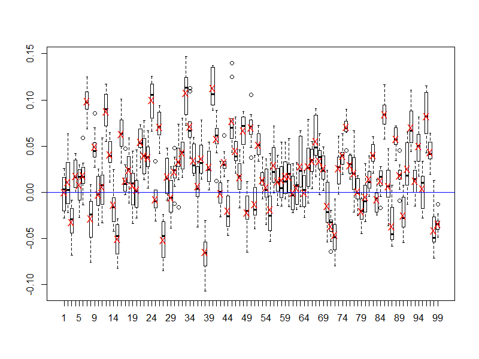

# Regression using Generalized Linear Models, Gradient Boosting Machines, and Random Forests in H2O

###### This tutorial demonstrates regression modeling in H2O using generalized linear models (GLM), gradient boosting machines (GBM), and random forests. It requires an installation of the h2o R package and its dependencies.

### Brief overview of regression modeling

#### Generalized Linear Models (GLM)

##### Intuition: A linear combination of predictors is sufficient for determining an outcome.

##### Important components:
###### 1. Exponential family for error distribution (Gaussian/Normal, Poisson, Gamma, Tweedie, etc.)
###### 2. Link function, whose inverse is used to generate predictions
###### 3. (Elastic Net) Mixing parameter between the L1 and L2 penalties on the coefficient estimates.
###### 4. (Elastic Net) Shrinkage parameter for the mixed penalty in 3.

#### Gradient (Tree) Boosting Machines (GBM)

##### Intuition: Average an ensemble of weakly predicting (small) trees where each tree "adjusts" to the "mistakes" of the preceding trees.

##### Important components:
###### 1. Number of trees
###### 2. Maximum depth of tree
###### 3. Learning rate ( *shrinkage* parameter)

###### where smaller learning rates tend to require larger number of tree and vice versa.

#### Random Forests

##### Intuition: Average an ensemble of weakly predicting (larger) trees where each tree is *de-correlated* from all other trees.

##### Important components:
###### 1. Number of trees
###### 2. Maximum depth of tree
###### 3. Number of variables randomly sampled as candidates for splits
###### 4. Sampling rate for constructing data set to use on each tree

### Load the h2o R package and start an local H2O cluster

###### We will begin this tutorial by starting a local H2O cluster using the default heap size and as much compute as the operating system will allow.

    library(h2o)
    h2oServer <- h2o.init(nthreads = -1)

    rmLastValues <- function(pattern = "Last.value.")
    {
      keys <- h2o.ls(h2oServer, pattern = pattern)$Key
      if (!is.null(keys))
        h2o.rm(h2oServer, keys)
      invisible(keys)
    }

### Load and prepare the training and testing data for analysis

###### This tutorial uses a 0.1% sample of the Person-Level 2013 Public Use Microdata Sample (PUMS) from United States Census Bureau with 75% of that sample being designated to the training data set and 25% to the test data set. This data set is intended to be an update to the [UCI Adult Data Set](https://archive.ics.uci.edu/ml/datasets/Adult).

    datadir <- "/data"
    pumsdir <- file.path(datadir, "h2o-training", "pums2013")
    trainfile <- "adult_2013_train.csv.gz"
    testfile  <- "adult_2013_test.csv.gz"

    adult_2013_train <- h2o.importFile(h2oServer,
                                       path = file.path(pumsdir, trainfile),
                                       key = "adult_2013_train", sep = ",")

    adult_2013_test <- h2o.importFile(h2oServer,
                                      path = file.path(pumsdir, testfile),
                                      key = "adult_2013_test", sep = ",")

    dim(adult_2013_train)
    dim(adult_2013_test)

###### For the purposes of validation, we will create a single column data set containing only the target variable `LOG_WAGP` from the test data set.

    actual_log_wagp <- h2o.assign(adult_2013_test[, "LOG_WAGP"],
                                  key = "actual_log_wagp")
    rmLastValues()

###### Also for our data set we have 8 columns that use integer codes to represent categorical levels so we will coerce them to factor after the data read.

    for (j in c("COW", "SCHL", "MAR", "INDP", "RELP", "RAC1P", "SEX", "POBP")) {
      adult_2013_train[[j]] <- as.factor(adult_2013_train[[j]])
      adult_2013_test[[j]]  <- as.factor(adult_2013_test[[j]])
    }
    rmLastValues()

### Fit a basic generalized linear model

###### To illustrate some regression concepts, we will add a column of random categories to the training data set.

    rand <- h2o.runif(adult_2013_train, seed = 123)
    randgrp <- h2o.cut(rand, seq(0, 1, by = 0.01))
    adult_2013_train <- cbind(adult_2013_train, RAND_GRP = randgrp)
    adult_2013_train <- h2o.assign(adult_2013_train, key = "adult_2013_train")
    rmLastValues()

###### We will start with an ordinary linear model that is trained using the `h2o.glm` function with Gaussian (Normal) error and no elastic net regularization (`lambda = 0`).

    log_wagp_glm_0 <- h2o.glm(x = "RAND_GRP", y = "LOG_WAGP",
                              data = adult_2013_train,
                              key  = "log_wagp_glm_0",
                              family = "gaussian",
                              lambda = 0)
    log_wagp_glm_0

### Inspect an object containing a single generalized linear model

###### When a single model is trained by `h2o.glm` it produces an object of class `H2OGLMModel`.

    class(log_wagp_glm_0)
    getClassDef("H2OGLMModel")

###### In this model object, most of the values of interest are contained in the `model` slot.

    names(log_wagp_glm_0@model)
    coef(log_wagp_glm_0@model) # works through stats:::coef.default
    log_wagp_glm_0@model$aic
    1 - log_wagp_glm_0@model$deviance / log_wagp_glm_0@model$null.deviance

###### In addition the `h2o.mse` function can be used to calculate the mean squared error of prediction.

    h2o.mse(h2o.predict(log_wagp_glm_0, adult_2013_test),
            adult_2013_test[, "LOG_WAGP"])
    rmLastValues()

### Perform 10-fold cross-validation to measure variation in coefficient estimates

###### We can perform cross-validation within an H2O GLM model by specifying an integer greater than 1 in the `nfolds` argument to the `h2o.glm` function.

    log_wagp_glm_0_cv <- h2o.glm(x = "RAND_GRP", y = "LOG_WAGP",
                                 data = adult_2013_train,
                                 key  = "log_wagp_glm_0_cv",
                                 family = "gaussian",
                                 lambda = 0,
                                 nfolds = 10L)

###### The resulting model object is also of class `H2OGLMModel`, but now the `xval` slot is populated with model fits resulting when one of the folds was dropped during training.

    class(log_wagp_glm_0_cv)
    length(log_wagp_glm_0_cv@xval)
    class(log_wagp_glm_0_cv@xval[[1L]])

###### We can create boxplots for each of the coefficients to see how variable the estimates were after each of the folds were dropped in turn.

    boxplot(t(sapply(log_wagp_glm_0_cv@xval, function(x) coef(x@model)))[,-100L],
            names = NULL)
    points(1:99, coef(log_wagp_glm_0_cv@model)[-100L], pch = "X", col = "red")
    abline(h = 0, col = "blue")

#####

### Explore categorical predictors

###### In generalized linear models, a categorical variable with k categories is expanded into k - 1 model coefficients. This expansion can occur in many different forms, with the most common being *dummy variable* encodings consisting of indicator columns for all but the first or last category, depending on the convention.

###### We will begin our modeling of the data by examining the regression of the natural logarithm of wages (`LOG_WAGP`) against three sets of predictors: relationship (`RELP`), educational attainment (`SCHL`), and combination of those two variables (`RELP_SCHL`).

    log_wagp_glm_relp <- h2o.glm(x = "RELP", y = "LOG_WAGP",
                                 data = adult_2013_train,
                                 key  = "log_wagp_glm_relp",
                                 family = "gaussian",
                                 lambda = 0)

    log_wagp_glm_schl <- h2o.glm(x = "SCHL", y = "LOG_WAGP",
                                 data = adult_2013_train,
                                 key  = "log_wagp_glm_schl",
                                 family = "gaussian",
                                 lambda = 0)

    log_wagp_glm_relp_schl <- h2o.glm(x = "RELP_SCHL", y = "LOG_WAGP",
                                      data = adult_2013_train,
                                      key  = "log_wagp_glm_relp_schl",
                                      family = "gaussian",
                                      lambda = 0)

###### As we can see below, both the Akaike information criterion (AIC) and percent deviance explained metrics point to using a combination of `RELP` and `SCHL` in a linear model for `LOG_WAGP`.

    log_wagp_glm_relp@model$aic
    log_wagp_glm_schl@model$aic
    log_wagp_glm_relp_schl@model$aic
    1 - log_wagp_glm_relp@model$deviance / log_wagp_glm_relp@model$null.deviance
    1 - log_wagp_glm_schl@model$deviance / log_wagp_glm_schl@model$null.deviance
    1 - log_wagp_glm_relp_schl@model$deviance / log_wagp_glm_relp_schl@model$null.deviance

### Fit an elastic net regression model across a grid of parameter settings

###### Now that we are familiar with H2O model fitting in R, we can fit more sophisticated models involving a larger set of predictors.

    addpredset <- c("COW", "MAR", "INDP", "RAC1P", "SEX", "POBP", "AGEP",
                    "WKHP", "LOG_CAPGAIN", "LOG_CAPLOSS")

###### In the context of elastic net regularization, we need to search the parameter space defined by the mixing parameter `alpha` and the shrinkage parameter `lambda`. To aide us in this search H2O can produce a grid of models for all combinations of a discrete set of parameters.

###### We will use different methods for specifying the `alpha` and `lambda` values as they are dependent upon one another. For the `alpha` parameter, we will specify five values ranging from 0 (ridge) to 1 (lasso) by increments of 0.25. For `lambda`, we will turn on an automated `lambda` search by setting `lambda = TRUE` and specify the number of `lambda` values to 10 by setting `nlambda = 10`.

    log_wagp_glm_grid <- h2o.glm(x = c("RELP_SCHL", addpredset), y = "LOG_WAGP",
                                 data = adult_2013_train,
                                 key  = "log_wagp_glm_grid",
                                 family = "gaussian",
                                 lambda_search = TRUE,
                                 nlambda = 10,
                                 return_all_lambda = TRUE,
                                 alpha = c(0, 0.25, 0.5, 0.75, 1))

###### We now have an object of class `H2OGLMGrid` that contains a list of `H2OGLMModelList` objects for each of the models fit on the grid.

    class(log_wagp_glm_grid)
    getClassDef("H2OGLMGrid")

    class(log_wagp_glm_grid@model[[1L]])
    getClassDef("H2OGLMModelList")

    length(log_wagp_glm_grid@model[[1L]]@models)
    class(log_wagp_glm_grid@model[[1L]]@models[[1L]])

###### Currently the `h2o` package does not contain any helper functions for extracting models of interest, so we have to explore the model object and choose the model we like best.

    log_wagp_glm_grid@model[[1L]]@models[[1L]]@model$params$alpha # ridge
    log_wagp_glm_grid@model[[2L]]@models[[1L]]@model$params$alpha
    log_wagp_glm_grid@model[[3L]]@models[[1L]]@model$params$alpha
    log_wagp_glm_grid@model[[4L]]@models[[1L]]@model$params$alpha
    log_wagp_glm_grid@model[[5L]]@models[[1L]]@model$params$alpha  # lasso

    log_wagp_glm_grid_mse <-
      sapply(log_wagp_glm_grid@model,
             function(x)
               sapply(x@models, function(y)
                      h2o.mse(h2o.predict(y, adult_2013_test),
                              actual_log_wagp)))
    log_wagp_glm_grid_mse
    log_wagp_glm_grid_mse == min(log_wagp_glm_grid_mse)

    log_wagp_glm_best <- log_wagp_glm_grid@model[[5L]]@models[[10L]]

### Fit a gaussian regression with a log link function

###### In the previous example we modeled `WAGP` on a natural logarithm scale, which implied a multiplicative error structure. We can explore if we have an additive error, but supplying the untransformed wage variable (`WAGP`) as the response and using the natural logarithm link function.

    wagp_glm_grid <- h2o.glm(x = c("RELP_SCHL", addpredset), y = "WAGP",
                             data = adult_2013_train,
                             key  = "log_wagp_glm_grid",
                             family = "gaussian",
                             link   = "log",
                             lambda_search = TRUE,
                             nlambda = 10,
                             return_all_lambda = TRUE,
                             alpha = c(0, 0.25, 0.5, 0.75, 1))
    wagp_glm_grid

### Fit a gradient boosting machine regression model

###### Given that not all relationships can be reduced to a linear combination or terms, we can compare the GLM results with that of a gradient (tree) boosting machine. As with the final GLM exploration, we will fit a grid of GBM models by varying the number of trees and the shrinkage rate and select the best model with respect to the test data set.

    log_wagp_gbm_grid <- h2o.gbm(x = c("RELP", "SCHL", addpredset),
                                 y = "LOG_WAGP",
                                 data = adult_2013_train,
                                 key  = "log_wagp_gbm_grid",
                                 distribution = "gaussian",
                                 n.trees = c(10, 20, 40),
                                 shrinkage = c(0.05, 0.1, 0.2),
                                 validation = adult_2013_test,
                                 importance = TRUE)
    log_wagp_gbm_grid

    class(log_wagp_gbm_grid)
    getClassDef("H2OGBMGrid")
    class(log_wagp_gbm_grid@model)
    length(log_wagp_gbm_grid@model)
    class(log_wagp_gbm_grid@model[[1L]])
    log_wagp_gbm_best <- log_wagp_gbm_grid@model[[1L]]
    log_wagp_gbm_best

###### A comparison of mean squared errors against the test set suggests our GBM fit outperforms our GLM fit.

    h2o.mse(h2o.predict(log_wagp_glm_best, adult_2013_test),
            actual_log_wagp)
    h2o.mse(h2o.predict(log_wagp_gbm_best, adult_2013_test),
            actual_log_wagp)

### Fit a random forest regression model

###### Lastly we will fit a single random forest model with 200 trees of maximum depth 10 and compare the mean squared errors across the three model types.

    log_wagp_forest <- h2o.randomForest(x = c("RELP", "SCHL", addpredset),
                                        y = "LOG_WAGP",
                                        data = adult_2013_train,
                                        key  = "log_wagp_forest",
                                        classification = FALSE,
                                        depth = 10,
                                        ntree = 200,
                                        validation = adult_2013_test,
                                        seed = 8675309,
                                        type = "BigData")
    log_wagp_forest

    h2o.mse(h2o.predict(log_wagp_glm_best, adult_2013_test),
            actual_log_wagp)
    h2o.mse(h2o.predict(log_wagp_gbm_best, adult_2013_test),
            actual_log_wagp)
    h2o.mse(h2o.predict(log_wagp_forest,   adult_2013_test),
            actual_log_wagp)
