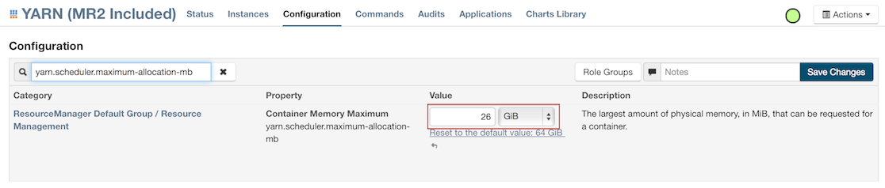
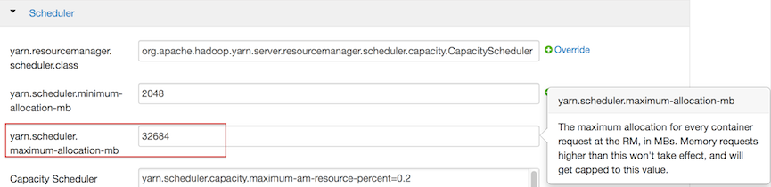

# Troubleshooting

- [H2O](#H2O)
	- [H2O: How Do I...?](#H2OHowDoI)
	- [H2O: Error Messages and Unexpected Behavior](#H2OErr)
- [H2O-Dev](#H2ODev)
	- [H2O-Dev: How Do I...?](#H2ODevHowDoI)
	- [H2O-Dev: Error Messages and Unexpected Behavior](#H2ODevErr)
- [H2O Web UI](#H2OWebUI)
	- [H2O Web UI: How Do I...?](#H2OWebUIHowDoI)
	- [H2O Web UI: Error Messages and Unexpected Behavior](#H2OWebUIErr)
- [Hadoop & H2O](#HadoopH2O)
	- [Hadoop & H2O: How Do I...?](#HadoopH2OHowDoI)
	- [Hadoop & H2O: Error Messages and Unexpected Behavior](#HadoopH2OErr)
- [R & H2O](#H2OR)
	- [R & H2O: How Do I...?](#H2ORHowDoI)
	- [R & H2O: Error Messages and Unexpected Behavior](#H2ORErr)
- [Clusters and H2O](#H2OCluster)
	- [Clusters and H2O: How Do I...?](#H2OClusterHowDoI)
	- [Clusters and H2O: Error Messages and Unexpected Behavior](#H2OClusterErr)
- [Sparkling Water](#SparklingH2O)
- [Java](#Java)
	- [Java: How Do I...?](#JavaHowDoI)


---
<a name="H2O"></a>
##H<sub>2</sub>O


----
<a name="H2OHowDoI"></a>
### H<sub>2</sub>O: How Do I...?


- [Classify a single instance at a time](#H2ClassifyInstance)
- [Export predicted values for all observations used in the model](#H2OExport)
- [Limit the CPU usage](#H2OLimitCPU)
- [Run multiple H2O projects by multiple team members on the same server](#H2ORunMultiNoCluster)
- [Run tests using Python](#H2OPython)
- [Specify multiple outputs](#H2OMultiOutput)
- [Tunnel between servers with H2O](#H2OTunnel)
- [Use H2O as a real-time, low-latency system to make predictions in Java](#H2OJavaModel)

---

<a name="H2OClassifyInstance"></a>
**Classify a single instance at a time**  

The plain Java (POJO) scoring predict API is: `public final float[] predict( double[] data, float[] preds)` 

	// Pass in data in a double[], pre-aligned to the Model's requirements.
	// Jam predictions into the preds[] array; preds[0] is reserved for the
	// main prediction (class for classifiers or value for regression),
	// and remaining columns hold a probability distribution for classifiers.

---

<a name="H2OExport"></a>
**Export predicted values for all observations used in the model**

Click the **Predict!** link at the top of the model page, then enter the training data frame key in the **data** entry field. To export the predicted data, click **Download as CSV** or **Export to file** and then select the file type (HDFS or NFS).

---


<a name="H2OLimitCPU"></a>
**Limit the number of CPUs that H2O uses** 


Use the `nthreads` command from the command line. 
For example, to limit the number of CPUs to two: 

	java -jar h2o.jar -nthreads 2

---
<a name="H2ORunMultiNoCluster"></a>
**Run multiple H2O projects by multiple team members on the same server**

We recommend keeping projects isolated, as opposed to running on the same instance. 
Launch each project in a new H2O instance with a different port number and different cloud name to prevent the instances from combining into a cluster: 

	java -Xmx1g -jar h2o.jar -port 20000 -name jane &
	java -Xmx1g -jar h2o.jar -port 20002 -name bob &
	...

You can also set the `-ip` flag to `localhost` to prevent cluster formation in H2O. 

---
<a name="H2OPython"></a>
**Run tests using Python** <h2O>


Refer to the following page for information on running tests using Python: <https://github.com/0xdata/h2o/wiki/How-To-Run-Tests>

---


<a name="H2OMultiOutput"></a>
**Specify multiple outputs**


Multiple response columns are not supported. You must train a new model for each response column.  


---
<a name="H2OTunnel"></a>
**Tunnel between servers with H2O**


1. Using ssh, log in to the machine where H2O will run.
2. Start an instance of H2O by locating the working directory and
calling a java command similar to the following example. The port number chosen here is arbitrary, so yours may be something different).
	
		$ java -jar h2o.jar -port  55599
	
3. This returns output similar to the following:

	    irene@mr-0x3:~/target$ java -jar h2o.jar -port 55599
	    04:48:58.053 main      INFO WATER: ----- H2O started -----
	    04:48:58.055 main      INFO WATER: Build git branch: master
	    04:48:58.055 main      INFO WATER: Build git hash: 64fe68c59ced5875ac6bac26a784ce210ef9f7a0
	    04:48:58.055 main      INFO WATER: Build git describe: 64fe68c
	    04:48:58.055 main      INFO WATER: Build project version: 1.7.0.99999
	    04:48:58.055 main      INFO WATER: Built by: 'Irene'
	    04:48:58.055 main      INFO WATER: Built on: 'Wed Sep  4 07:30:45 PDT 2013'
	    04:48:58.055 main      INFO WATER: Java availableProcessors: 4
	    04:48:58.059 main      INFO WATER: Java heap totalMemory: 0.47 gb
	    04:48:58.059 main      INFO WATER: Java heap maxMemory: 6.96 gb
	    04:48:58.060 main      INFO WATER: ICE root: '/tmp'
	    04:48:58.081 main      INFO WATER: Internal communication uses port: 55600
	    +                                  Listening for HTTP and REST traffic on  http://192.168.1.173:55599/
	    04:48:58.109 main      INFO WATER: H2O cloud name: 'irene'
	    04:48:58.109 main      INFO WATER: (v1.7.0.99999) 'irene' on
	    /192.168.1.173:55599, discovery address /230 .252.255.19:59132
	    04:48:58.111 main      INFO WATER: Cloud of size 1 formed [/192.168.1.173:55599]
	    04:48:58.247 main      INFO WATER: Log dir: '/tmp/h2ologs'

4. Log into the remote machine where the running instance of H2O will be
forwarded using a command similar to the following example. Your port numbers and IP address will be different.

    	ssh -L 55577:localhost:55599 irene@192.168.1.173

5. Check cluster status.

You are now using H2O from localhost:55577, but the
instance of H2O is running on the remote server (in this
case, the server with the ip address 192.168.1.xxx) at port number 55599.

To see this in action, note that the web UI is pointed at
localhost:55577, but that the cluster status shows the cluster running
on 192.168.1.173:55599


---
<a name="H2OJavaModel"></a>
**Use H2O as a real-time, low-latency system to make predictions in Java**


0. Build a model (for example, a GBM model with just a few trees). 
1. Export the model as a Java POJO: Click the **Java Model** button at the top right of the web UI. This code is self-contained and can be embedded in any Java environment, such as a Storm bolt, without H2O dependencies. 
0. Use the `predict()` function in the downloaded code.

---
<a name="H2OErr"></a>
### H<sub>2</sub>O: Error Messages and Unexpected Behavior


- [Exception error with HDFS on CDH3](#H2OErrHDFS)
- [Unmatched quote char](#H2OErrQuote)
- [Can't start up: not enough memory](#H2OErrMemory)
- [Parser setup appears to be broken, got SVMLight data with (estimated) 0 columns.](#H2OErrParser)
- [Categories or coefficients missing after fitting the model](#H2OErrMissingCat)

---
<a name="H2OErrHDFS"></a>
**When I try to initiate a standalone instance of  using an HDFS data on CDH3, I get an exception error - what should I do?** 


The default HDFS version is CDH4. To use CDH3, use `-hdfs_version cdh3`.

	$ java -Xmx4g -jar h2o.jar -name Test -hdfs_version cdh3
	...
	05:37:13.588 main      INFO WATER: Log dir: '/tmp/h2o-srisatish/h2ologs'
	05:37:13.589 main      INFO WATER: HDFS version specified on the command line: cdh3

---
<a name="H2OErrQuote"></a>
**I received an** `Unmatched quote char` **error message and now the number of columns does not match my dataset.**


H2O supports only ascii quotation marks ( Unicode 0022, `"`  ) and apostrophes ( Unicode 0027, `'` ) in datasets. All other character types are treated as enum when they are parsed. 

---
<a name="H2OErrMemory"></a>
**When launching using** `java -Xmx1g -jar h2o.jar`**, I received a** `Can't start up: not enough memory` **error message, but according to** `free -m` **, I have more than enough memory. What's causing this error message?** 


Make sure you are using the correct version of Java Developer Toolkit (at least 1.6 or later). For example, GNU compiler for Java and Open JDK are not supported. 

The current recommended JDK is JDK 7 from Oracle: <http://www.oracle.com/technetwork/java/javase/downloads/jdk7-downloads-1880260.html>

However, JDK 6 is also supported:<http://www.oracle.com/technetwork/java/javase/downloads/java-archive-downloads-javase6-419409.html>
 
---
<a name="H2OErrParser"></a>
**What does the following error message indicate?**  `"Parser setup appears to be broken, got SVMLight data with (estimated) 0 columns."`

H2O does not currently support a leading label line. Convert a row from:

	i 702101:1 732101:1 803101:1 808101:1 727101:1 906101:1 475101:1
	j 702101:1 732101:1 803101:1 808101:1 727101:1 906101:1 475101:1

to

	1 702101:1 732101:1 803101:1 808101:1 727101:1 906101:1 475101:1
	2 702101:1 732101:1 803101:1 808101:1 727101:1 906101:1 475101:1

and the file should parse.

---
<a name="H2OErrMissingCat"></a>
**Why are my categories or coefficients missing after fitting the model?**

If you are running a model with more than 7.5k predictors (including expanded factor levels) or a model with 0-value coefficients, the output is truncated. 
To run without L1 penalties, set `alpha=0`. However, if you have more than 7.5k predictors, this is not recommended as it will increase the training time. 

---
<a name="H2ODev"></a>
##H<sub>2</sub>O-Dev


---
<a name="H2ODevHowDoI"></a>
### H<sub>2</sub>O-Dev: How Do I...?


- [Run Java APIs](#H2ODevAPI)
- [Use an h2o-dev artifact as a dependency in a new project](#H2ODevArtifact)

---

<a name="H2ODevAPI"></a>
**Run developer APIs** 

After you've done the gradle build, refer to the following generated resources in your workspace:

	REST: 
	- build/docs/REST/markdown
	
	JAVA: 
	- h2o-core/build/docs/javadoc/index.html
	- h2o-algos/build/docs/javadoc/index.html

---

<a name="H2ODevArtifact"></a>
**Use an h2o-dev artifact as a dependency in a new project**

Refer to the following blog post: <http://h2o.ai/blog/2014/10/running-your-first-droplet-on-h2o/>

---


<a name="H2ODevErr"></a>
### H<sub>2</sub>O-Dev: Error Messages and Unexpected Behavior


- [`ice_root not a read/writable directory`](#H2ODevIceRoot)

---
<a name="H2ODevErrIceRoot"></a> 
**When I try to start , I get the following output:**`ice_root not a read/writable directory` **- what do I need to do?** <common to H2O & dev>


If you are using  on OS X and you are using an admin account, the `user.name` property is set to `root` by default.  To resolve this issue, disable the `setuid` bit in the Java executable. 

---
<a name="H2OWebUI"></a>
##H<sub>2</sub>O Web UI

---
<a name="H2OWebUIHowDoI"></a>
###H<sub>2</sub>O Web UI: How Do I...?

- [Export a GBM or RF model POJO with more than 10 trees](#H2OLicense)
- [Load multiple files from multiple directories](#H2OLoadMultiDir)

---
<a name="H2OLicense"></a>
**Export a GBM or RF model POJO with more than 10 trees** 


Please [contact us](support@0xdata.com) for a license. After you receive the license,  run H2O with the `-license` argument as shown in the following example to export larger models.

	java -Xmx1g -jar h2o.jar -license license_file_name.asc

---
<a name="H2OLoadMultiDir"></a>
**Load multiple files from multiple directories** 


To load multiple files from multiple directories, import the first directory but do not parse. Import the second directory but do not parse. After you have imported the directories, go to **Data** > **Parse**. In the “source key” entry field, enter the pattern for your file types (for example, `“*.data”` or `“*.csv”`). The preview displays all imported files matching the pattern. 

---
<a name="H2OWebUIErr"></a>
###H<sub>2</sub>O Web UI: Error Messages and Unexpected Behavior 

- [Exception error after starting a job in the web UI when trying to access the job in R](#H2ORExceptionErr)
- [Failure to load file using web UI](#H2ORFileLoadFail)

---

<a name="H2ORExceptionErr"></a>  
**Why did I receive an exception error after starting a job in the web UI when I tried to access the job in R?**


To prevent errors,  locks the job after it starts. Wait until the job is complete before accessing it in R or invoking APIs. 

---
<a name="H2ORFileLoadFail"></a> 
**I tried to load a file of less than 4 GB using the web interface, but it failed; what should I do?**


To increase the H2O JVM heap memory size, use `java -Xmx8g -jar h2o.jar`. 

--- 
<a name="HadoopH2O"></a>
##Hadoop & H<sub>2</sub>O

---

<a name="HadoopH2OHowDoI"></a>
###Hadoop & H<sub>2</sub>O: How Do I...? 

- [Find the syntax for the file path of a data set sitting in hdfs](#HadoopH2OHDFS)
- [Launch the H2O cluster on Hadoop nodes using R’s h2o.init() command](#LaunchR)
- [Launch  and form a cluster on the Hadoop cluster](#ClusterHadoop)


---
<a name="HadoopH2OHDFS"></a>
**Find the syntax for the file path of a data set sitting in hdfs**


To locate an HDFS file, go to **Data > Import** and enter `hdfs://` in the **path** field. H2O automatically detects any HDFS paths. This is a good way to verify the path to your data set before importing through R or any other non-web API.

---
<a name="LaunchR"></a>
**Launch the H2O cluster on Hadoop nodes using R’s h2o.init() command**


This is not supported. Follow the instructions in the [Hadoop Tutorial](http://docs.h2o.ai/deployment/hadoop_tutorial.html) and add the IP address to the `h2o.init()` function to connect to the cluster.

---
<a name="ClusterHadoop"></a>
**LaunchH2O and form a cluster on the Hadoop cluster**  


	$ hadoop jar <h2o_driver_jar_file> water.hadoop.h2odriver [-jt <jobtracker:port>]
	-libjars ../h2o.jar -mapperXmx 1g -nodes 1 -output hdfsOutputDirName


---

<a name="HadoopH2OErr"></a>
###Hadoop & H<sub>2</sub>O: Error Messages and Unexpected Behavior


- [ERROR: Output directory hdfs://sandbox.hortonworks.com:8020/user/root/hdfsOutputDir already exists](#HadoopH2OOutputDir)
- [H2O starts to launch but times out in 120 seconds](#HadoopH2O120Timeout)
- [H<sub>2</sub>O job launches but  terminates after 600 seconds](#HadoopH2O600Timeout)
- [YARN doesn't launch and H2O times out](#HadoopH2OHeapSize)
- [Can't connect to Hadoop cluster](#ClusterErrHadoop)

---
<a name="HadoopH2OOutputDir"></a>
**What does** `ERROR: Output directory hdfs://sandbox.hortonworks.com:8020/user/root/hdfsOutputDir already exists` **mean?**


Each job gets its own output directory in HDFS. To prevent overwriting multiple users' files, each job must have a unique output directory name. Change
the `-output hdfsOutputDir` argument to `-output hdfsOutputDir1` and the job should launch.

---
<a name="HadoopH2O120Timeout"></a>
**What should I do if H2O starts to launch but times out in 120 seconds?**


1. YARN or MapReduce's configuration is not configured correctly. Enable launching for mapper tasks of specified memory sizes. If YARN only allows mapper tasks with a maximum memory size of 1g and the request requires 2g, then the request will timeout at the default of 120 seconds. Read [Configuration Setup](http://hortonworks.com/blog/how-to-plan-and-configure-yarn-in-hdp-2-0/) to make sure your setup will run.

2. The nodes are not communicating with each other. If you request a cluster of two nodes and the output shows a stall in reporting the other nodes and forming a cluster (as shown in the following example), check that the security settings for the network connection between the two nodes are not preventing the nodes from communicating with each other. You should also check to make sure that the flatfile that is generated and being passed has the correct home address; if there are multiple local IP addresses, this could be an issue.

		$ hadoop jar h2odriver_horton.jar water.hadoop.h2odriver -libjars ../h2o.jar
		-driverif 10.115.201.59 -timeout 1800 -mapperXmx 1g -nodes 2 -output hdfsOutputDirName
		13/10/17 08:51:14 INFO util.NativeCodeLoader: Loaded the native-hadoop library
		13/10/17 08:51:14 INFO security.JniBasedUnixGroupsMapping: Using JniBasedUnixGroupsMapping for
		Group resolution
		Using mapper->driver callback IP address and port: 10.115.201.59:34389
		(You can override these with -driverif and -driverport.)
		Driver program compiled with MapReduce V1 (Classic)
		
		Memory Settings:
        mapred.child.java.opts:      -Xms1g -Xmx1g
        mapred.map.child.java.opts:  -Xms1g -Xmx1g
        Extra memory percent:        10
        mapreduce.map.memory.mb:     1126
        Job name 'H2O_61026' submitted
        JobTracker job ID is 'job_201310092016_36664'
        Waiting for H2O cluster to come up...
        H2O node 10.115.57.45:54321 requested flatfile
        H2O node 10.115.5.25:54321 requested flatfile
        Sending flatfiles to nodes...
        [Sending flatfile to node 10.115.57.45:54321]
        [Sending flatfile to node 10.115.5.25:54321]
        H2O node 10.115.57.45:54321 reports H2O cluster size 1
        H2O node 10.115.5.25:54321 reports H2O cluster size 1

---
<a name="HadoopH2O600Timeout"></a>
**What should I do if theH2O job launches but  terminates after 600 seconds?**


The likely cause is a driver mismatch - check to make sure the Hadoop distribution matches the driver jar file used to launchH2O. If your distribution is not currently
available in the package, [email us](support@0xdata) for a new driver file.


---
<a name="HadoopH2OHeapSize"></a>
**What should I do if I want to create a job with a bigger heap size but YARN doesn't launch and H2O times out?**


First, try the job again but with a smaller heap size (`-mapperXmx`) and a smaller number of nodes (`-nodes`) to verify that a small launch can proceed.

If the cluster manager settings are configured for the default maximum memory size but the memory required for the request exceeds that amount, YARN will not launch andH2O will time out. 
If you have a default configuration, change the configuration settings in your cluster manager to enable launching of mapper tasks for specific memory sizes. Use the following formula to calculate the amount of memory required: 


    YARN container size 
    == mapreduce.map.memory.mb
    == mapperXmx + (mapperXmx * extramempercent [default is 10%])

Output from anH2O launch is shown below:


    $ hadoop jar h2odriver_hdp2.1.jar water.hadoop.h2odriver 
    -libjars ../h2o.jar -mapperXmx 30g -extramempercent 20 -nodes 4 -output hdfsOutputDir
    Determining driver host interface for mapper->driver callback...
    [Possible callback IP address: 172.16.2.181]
    [Possible callback IP address: 127.0.0.1]
    Using mapper->driver callback IP address and port: 172.16.2.181:58280
    (You can override these with -driverif and -driverport.)
    Driver program compiled with MapReduce V1 (Classic)
    14/10/10 18:39:53 INFO Configuration.deprecation: mapred.map.child.java.opts is deprecated.
     Instead, use mapreduce.map.java.opts
    Memory Settings:
    mapred.child.java.opts:      -Xms30g -Xmx30g
    mapred.map.child.java.opts:  -Xms30g -Xmx30g
    Extra memory percent:        20
    mapreduce.map.memory.mb:     36864


`mapreduce.map.memory.mb` must be less than the YARN memory configuration values for the launch to succeed.  See the examples below for how to change the memory configuration values for your version of Hadoop.


**For Cloudera, configure the settings in Cloudera Manager. Depending on how the cluster is configured, you may need to change the settings for more than one role group.**
	
1. Click **Configuration** and enter the following search term in quotes: **yarn.nodemanager.resource.memory-mb**.

2. Enter the amount of memory (in GB) to allocate in the **Value** field. If more than one group is listed, change the values for all listed groups.
	
	
	

	
3. Click the **Save Changes** button in the upper-right corner. 
4. Enter the following search term in quotes: `yarn.scheduler.maximum-allocation-mb`
5. Change the value, click the **Save Changes** button in the upper-right corner, and redeploy.
	
	

			
	
**For Hortonworks,** [configure](http://docs.hortonworks.com/HDPDocuments/Ambari-1.6.0.0/bk_Monitoring_Hadoop_Book/content/monitor-chap2-3-3_2x.html) **the settings in Ambari.**

1. Select **YARN**, then click the **Configs** tab. 
2. Select the group. 
3. In the **Node Manager** section, enter the amount of memory (in MB) to allocate in the `yarn.nodemanager.resource.memory-mb` entry field. 
	
	

	  
4. In the **Scheduler** section, enter the amount of memory (in MB) to allocate in the `yarn.scheduler.maximum-allocation-mb` entry field. 
	
	

5. 	Click the **Save** button at the bottom of the page and redeploy the cluster. 
	

**For MapR:** 

1. Edit the `yarn-site.xml` file for the node running the ResourceManager. 
2. Change the values for the `yarn.nodemanager.resource.memory-mb` and `yarn.scheduler.maximum-allocation-mb` properties.
3. Restart the ResourceManager and redeploy the cluster. 
	

To verify the values were changed, check the values for the following properties:
 	
- `<name>yarn.nodemanager.resource.memory-mb</name>`
- `<name>yarn.scheduler.maximum-allocation-mb</name>`

**Note:** Due to Hadoop's memory allocation, the memory allocated forH2O on Hadoop is retained, even when no jobs are running. 

---

<a name="ClusterErrHadoop"></a>
**I can’t connect to the Hadoop cluster - what do I do?** 


The mapper nodes need to be able to communicate with the driver node. The driver node (the machine running the job) uses a default IP address that is displayed in the output as `“Using mapper->driver callback IP address and port:”`  after attempting to connect the cluster. If that network interface is not reachable by the mapper nodes, assign a driver node using `-driverif`. The IP address used by the driver should start with the same numbers as the IP addresses used by the mapper nodes. 

---


<a name="H2OR"></a>

##R and H<sub>2</sub>O


---

<a name="H2ORHowDoI"></a>
###R and H<sub>2</sub>O: How Do I...?

- [Access the confusion matrix using R](#H2ORDeepLearning)
- [Assign a value to a data key](#H2OAssign)
- [Change an entire integer column to enum](#H2ORChgCol)
- [Create test and train data split](#H2OFilterData)
- [Export data for post-analysis](#H2ORExport)
- [Extract associated values (such as variable name and value) separately](#H2ORExtractValues)
- [Extract information and export the data locally](#H2ORExtractExport)
- [Extract the Neural Networks representation of the input](#H2ORNN)
- [InstallH2O in R without internet access](#InstallRNoInternet)
- [Join split datasets](#H2ORJoin)
- [Launch a multi-nodeH2O cluster in R](#H2ORLaunchR)
- [Load a .hex data set in R](#H2ORLoadData)
- [Manage dependencies in R](#H2ORDependencies)
- [Perform a mean imputation for NA values](#H2ORMean)
- [Transfer data frames from R toH2O or vice versa](#H2ORTransferData)
- [Specify column headings and data from separate files](#H2ORColHeading)
- [Specify a threshold for validating performance](#H2ORSpecifyThreshold)
- [Sort and view variable importance for Random Forest](#H2OSortVariable)
- [Sub-sample data](#H2ORSubsample)
- [Update the libraries in R to the current version](#H2ORUpdateLib)

---

<a name="H2ORDeepLearning"></a>
**Access the confusion matrix through the R interface** 

To access the confusion matrix & error rates, use `dp.modelObj@model$train_class_error`

---

<a name="H2OAssign"></a>
**Assign a value to a data key**  


To reassign the value of any data key, use 
	
	h2o.assign (data,key)

where `data` is the frame containing the key and `key` is the new key. 

---

<a name="H2ORChgCol"></a>

**Change an entire integer column to enum**

Run the following commands twice; after you run it the second time, the value changes from FALSE to TRUE.
	
	data.hex[,2] = as.factor(data.hex[,2])
	is.factor(data.hex[,2])

---
<a name="H2OFilterData"></a>
**Create a test & train split of my data before building a model**


To create a test and train data split, (for example, to exclude rows with values outside of a specific range): 

	s = h2o.splitFrame(air)
	air.train = air[s <= 0.8,]
	air.valid = air[s > 0.8,]

---

<a name="H2ORExport"></a>

**Export scored or predicted data in a format that will allow me to do post-analysis work, such as building an ROC curve**


Use `pred = h2o.predict(...)` and convert the data parsed byH2O to an R data frame using `predInR = as.data.frame(pred)`. 

For a two-class set, the two probability class should be available in conjunction to the labels output from `h2o.predict()`.

	head(pred)
	predict        X0          X1
	1       0 0.9930366 0.006963459
	2       0 0.9933736 0.006626437
	3       0 0.9936944 0.006305622
	4       0 0.9939933 0.006006664
	5       0 0.9942777 0.005722271
	6       0 0.9950644 0.004935578

Here you can take the entire data frame into R:

	predInR = as.data.frame(pred)

or compile it separately, subset it inH2O, then bring it into R:

	class1InR = as.data.frame(pred[,2])
	class2InR = as.data.frame(pred[,3])

---

<a name="H2ORExtractValues"></a>  
**Extract variable importance from the output**

Launch R, then enter the following: 

	library(h2o)
	h <- h2o.init()
	hex <- as.h2o(h, iris)
	m <- h2o.gbm(x=1:4, y=5, data=hex, importance=T)

	m@model$varimp
            	 Relative importance Scaled.Values Percent.Influence
	Petal.Width          7.216290000  1.0000000000       51.22833426
	Petal.Length         6.851120500  0.9493965043       48.63600147
	Sepal.Length         0.013625654  0.0018881799        0.09672831
	Sepal.Width          0.005484723  0.0007600474        0.03893596

The variable importances are returned as an R data frame and you can extract the names and values of the data frame as follows: 

	is.data.frame(m@model$varimp)
	# [1] TRUE

	names(m@model$varimp)
	# [1] "Relative importance" "Scaled.Values"       "Percent.Influence"  

	rownames(m@model$varimp)
	# [1] "Petal.Width"  "Petal.Length" "Sepal.Length" "Sepal.Width"

	m@model$varimp$"Relative importance"
	# [1] 7.216290000 6.851120500 0.013625654 0.005484723


---

<a name="H2ORExtractExport"></a>

**Extract information (such as coefficients or AIC) and export the data locally**

When you run a model, for example

	data.glm = h2o.glm(x=myX, y=myY, data=data.train, family="binomial", nfolds=0, standardize=TRUE)

The syntax is similar to the way you would use `model$coefficients`:
	
	data.glm@model$coefficients

For other available parts to the `data.glm@model` object, press the  Tab key in R to auto-complete `data.glm@model$` or run `str(data.glm@model)` to see all the components in the model object.


---
<a name="H2ORNN"></a>
**Extract the Neural Networks representation of the input**

To extract the NN representation of the input at different hidden layers of the learned model (hidden layer learned features), use the Deep Feature Extractor model in R, `h2o.deepfeatures ()` after building a Deep Learning model. 

Specify the DL model (which can be auto-encoder or regular DNN), the dataset to transform, and the desired hidden layer index (0-based in GUI or Java, 1-based in R). The result is a new dataset with the features based on the specified hidden layer. 

	library(h2o)
	localH2O = h2o.init()
	prosPath = system.file("extdata", "prostate.csv", package = "h2o")
	prostate.hex = h2o.importFile(localH2O, path = prosPath)
	prostate.dl = h2o.deeplearning(x = 3:9, y = 2, data = prostate.hex, hidden = c(100, 200),epochs = 5)
	prostate.deepfeatures_layer1 = h2o.deepfeatures(prostate.hex, prostate.dl, layer = 1)
	prostate.deepfeatures_layer2 = h2o.deepfeatures(prostate.hex, prostate.dl, layer = 2)
	head(prostate.deepfeatures_layer1)
	head(prostate.deepfeatures_layer2)

---

<a name="InstallRNoInternet"></a>
**InstallH2O in R without internet access** <R>


Download the package on another machine with internet access and copy it via a USB drive to the machine where you will installH2O. You can run the `install.packages` command below replacing the path to tar gz file in your zipped file.

	if ("package:h2o" %in% search()) { detach("package:h2o", unload=TRUE) }
	if ("h2o" %in% rownames(installed.packages())) { remove.packages("h2o") }
	install.packages("/PATH/TO/TAR/FILE/ON/DISK", repos = NULL, type = "source")

Caveat: You might need to install some dependencies such as statmod, rjson, bitops, and RCurl as well. If you don't already have them, download the package onto a drive and install it in R before installingH2O. <ADD LINK TO R INSTALL>

---

<a name="H2ORJoin"></a>
**Join split datasets** <use bind - add to tutorial>


To join split datasets:

	library (h2o)
	localH2O = h2o.init(nthreads = -1) 
	df1 = data.frame(matrix(1:30, nrow=30, ncol=10)) 
	df2 = data.frame(matrix(31:50, nrow=30, ncol=1)) 
	df1.h2o = as.h2o(localH2O, df1)
	df2.h2o = as.h2o(localH2O, df2)
	binded_df = cbind(df1.h2o, df2.h2o)
	binded_df

---

<a name="H2ORLaunchR"></a>
**Launch a multi-node H2O cluster from R**


H<sub>2</sub>O does not support launching a multi-node H2O cluster from R. 

To start an H2O cluster in R: 

0. From your cluster manager (for example, Hadoop), launch the clusters. For more information about launching clusters using Hadoop, refer to the [Hadoop Tutorial](http://s3.amazonaws.com/h2o-release/h2o/master/1577/docs-website/deployment/hadoop_tutorial.html).  

0. Point to the cluster you just started in R:

		localH2O = h2o.init(ip="<IPaddress>",port=54321) 
		airlines.hex = h2o.importFile(localH2O, "hdfs://sandbox.hortonworks.com:8020/user/root/airlines_allyears2k_headers.csv") 
	

---
<a name="H2ORLoadData"></a>
**Load a .hex data set in R**

		h2o.getFrame =  new("H2OParsedData", h2o=object, key=key)
		h2o.getModel <look at in R> 
		head(df.h2o)

(Where "object" is the H2O object in R and "key" is the key displayed in the web UI.)


---
<a name="H2ORDependencies"></a>

**Manage dependencies in R**


The   H2O R package utilizes other R packages
(like lattice and curl).  Get the binary from CRAN directly and install the package manually using:

    install.packages("path/to/fpc/binary/file", repos = NULL, type = "binary")

Users may find this page on installing dependencies helpful:
<http://stat.ethz.ch/R-manual/R-devel/library/utils/html/install.packages.html>

---
<a name="H2ORMean"></a>
**Perform a mean imputation for NA values**

	?h2o.impute ,look up in R>

	df = data.frame(x = 1:20, y = c(1:10,rep(NA,10)))
	df$y[is.na(df$y)] = mean(df$y, na.rm=TRUE)

Source: <http://www.r-bloggers.com/example-2014-5-simple-mean-imputation/>

---
<a name="H2ORTransferData"></a>
**Transfer data frames from R to H2O or vice versa**


Convert an H2O object to an R object using `as.data.frame(h2oParsedDataObject)` : 

	predCol = as.data.frame(pred$predict)

Convert an R object to an H2O object using `as.h2o(rDataFrame)`:

	predTesting = as.h2o(predCol)


---
<a name="H2ORColHeading"></a>
**Specify column headings and data from separate files**


To specify column headings and data from separate files, enter the following in R: 

	> colnames(df)
	[1] "Sepal.Length" "Sepal.Width"  "Petal.Length" "Petal.Width"  "Species"     
	> colnames(df) = c("A", "B", "C", "D", "E")
	> colnames(df)
	[1] "A" "B" "C" "D" “E"

Through the REST API, it looks like this:

	05:25:25.545 # Session INFO HTTPD: POST /2/SetColumnNames2.json comma_separated_list=A,B,C,D,E source=key-name-here

You can also specify headers from another file when importing(`h2o.importFiles...header=` )

---
<a name="H2ORSpecifyThreshold"></a>
**Specify a threshold for validating performance**

By default, H2O chooses the best threshold and best AUC value. When it scores against a new data set, the parameter threshold is set to the best threshold calculated by H2O. 
To specify your own threshold, use `h2o.performance`. In the following example, H2O takes the third column, sets the threshold, generates a new vector prediction that will be compared to the reference vector, and exports the selected validation measurement ("max_per_class_error"). 
	
	h2o.performance(predict.glm[,3], reference, measure="max_per_class_error", thresholds)

---


<a name="H2OSortVariable"></a>
**Sort and view variable importance for Random Forest** 


	library(h2o)
	h <- h2o.init()
	hex <- as.h2o(h, iris)
	m <- h2o.randomForest(x = 1:4, y = 5, data = hex, importance = T)
	m@model$varimp
	as.data.frame(t(m@model$varimp))  # transpose and then cast to data.frame
	
---


<a name="H2ORSubsample"></a>
**Sub-sample data**


To sub-sample data (select 10% of dataset randomly), use the following command: 

	splits=h2o.splitFrame(data.hex,ratios=c(.1),shuffle=T)
	small = splits[[1]]
	large = splits[[2]]

The following sample script that will take data sitting in H2O, take the column you want to subset by, and create a new dataset with a certain number of rows:

	str_sampling <- function(data, label, rows){
	row_indices = h2o.exec(expr_to_execute = seq(1,nrow(data),1), h2o = data@h2o)
	labels = data[,label]
	label_col = cbind(labels, row_indices)
	
	idx0 = label_col[label_col[,1] == levels(labels)[1] ] [,2]
	idx1 = label_col[label_col[,1] == levels(labels)[2] ] [,2]
    
    random0 = h2o.runif(idx0)
    random1 = h2o.runif(idx1)
    
    select_idx0 = idx0[random0 <= ceiling((rows*0.5)/length(idx0))+0.01] [1:(rows*0.5)]
    select_idx1 = idx1[random1 <= ceiling((rows*0.5)/length(idx1))+0.01] [1:(rows*0.5)]
    
    all_idx = h2o.exec(c(select_idx0,select_idx1))
    dataset = h2o.exec(data[all_idx,])
    
    dataset
    }

This is just one example of subsampling using H2O in R; adjust it to weights you find suitable for the type of sampling you want to do. Depending on the way you subsample your data, it might not necessarily be balanced. Updating to the latest version of H2O will give you the option to rebalance your data in H2O.

Keep in mind that H2O data frames are handled differently than R data frames. To subsample a data frame on a subset from a vector, add a new 0/1 column for each feature and then combine the relevant pieces using OR (in the following example, the result is `df$newFeature3`):

	df.r = iris

	df = as.h2o(h, df.r)
	  |========================================================| 100%

	 head(df)
	   Sepal.Length Sepal.Width Petal.Length Petal.Width Species
	1          5.1         3.5          1.4         0.2  setosa
	2          4.9         3.0          1.4         0.2  setosa
	3          4.7         3.2          1.3         0.2  setosa
	4          4.6         3.1          1.5         0.2  setosa
	5          5.0         3.6          1.4         0.2  setosa
	6          5.4         3.9          1.7         0.4  setosa

	tail(df)
	Sepal.Length Sepal.Width Petal.Length Petal.Width   Species
	145          6.7         3.3          5.7         2.5 virginica
	146          6.7         3.0          5.2         2.3 virginica
	147          6.3         2.5          5.0         1.9 virginica
	148          6.5         3.0          5.2         2.0 virginica
	149          6.2         3.4          5.4         2.3 virginica
	150          5.9         3.0          5.1         1.8 virginica

	df$newFeature1 = df$Species == "setosa"

	df$newFeature2 = df$Species == "virginica"

	df$newFeature1 = (df$Species == "setosa" | df$Species == "virginica")


---
<a name="H2ORUpdateLib"></a>
**Update the libraries in R to the current version**

First, do a clean uninstall of any previous packages:

	if ("package:h2o" %in% search()) { detach("package:h2o", unload=TRUE) }
	if ("h2o" %in% rownames(installed.packages())) { remove.packages("h2o") }

After unzipping the .zip file of the latest version of H2O, go to the h2o-<VersionNumber>/R folder and issue `R CMD INSTALL h2o_<VersionNumber>.tar.gz`. 

---


<a name="H2ORErr"></a>
###R and H<sub>2</sub>O: Error Messages and Unexpected Behavior


- [Version mismatch error during initialization](#H2ORVersionMismatch)
- [H2O connection severed during file import](#H2ORConnectionSevered)
- [Internal Server Error in R](#H2ORInternalServerError)
- [H<sub>2</sub>O stalls/fails to start after allocating more memory](#H2ORMemoryErr)
- [Fields associated with incorrect headers after loading in R using as.h2o](#H2ORComma)
- [Error in function (type, msg, asError = TRUE) Failure when receiving data from the peer](#H2ORErrinFunction)
- [Only one CPU used when starting H2O from R](#H2OR1CPU)
- [names() does not display column names](#H2ORErrNames)
- [String entries converted to NA during parsing](#H2ORErrNA)
- [Column domain is too large to be represented as an enum : 10001>10000?](#H2ORErrColDomain)
- [Picked up _JAVA_OPTIONS: -Xmx512M](#H2ORErrJavaOption)
- [Entire table does not display when using h2o.table()](#H2ORErrTable)


---

<a name="H2ORVersionMismatch"></a>
**I received a** `Version mismatch` **error during initialization. What do I do?**


If you see a response message in R indicating that the instance of
H<sub>2</sub>O running is a different version than that of the corresponding
H<sub>2</sub>O R package, download the correct version of
H<sub>2</sub>O from <http://h2o.ai/download/>. Follow the
installation instructions on the download page.

---
<a name="H2ORConnectionSevered"></a>
**I was importing a file when I received the following error message:** `H2O connection has been severed.` **What should I do?**


Confirm the R package is the current version. If not, upgrade H2O and the R client and retry the file import. 

If the instance is unavailable, relaunch the cluster. If you still can't connect, email [support](support@0xdata.com). 

---
<a name="H2ORInternalServerError"></a> 
**What do I do if received an Internal Server Error in R error message?**

This issue is only applicable to OS X and older versions of R that cannot make the build due to a missing GNU-TAR package. 

Enter the following in Terminal: 

    brew install gnu-tar
    cd /usr/bin
    sudo ln -s /usr/local/opt/gnu-tar/libexec/gnubin/tar gnutar

---
<a name="H2ORMemoryErr"></a>
**When I tried to start an instance larger than 1 GB using** `h2o.init()`**, H2O stalled and failed to start.**


Check the output in the .out and .err files listed in the output from `h2o.init()` and verify that you have the 64-bit version of Java installed using `java -version`.

To force H2O to run in 64-bit mode, use the `java -d64` flag with the `-version` command. 

---
<a name="H2ORComma"></a>
**I tried to load an R data frame into H2O using** `as.h2o` **and now the fields have shifted so that they are associated with the incorrect header. What caused this error?**


Check to make sure that none of the data fields contain a comma as a value. 

---
<a name="H2ORErrinFunction"></a>
**When trying to run H2O in R, I received the following error message:**`Error in function (type, msg, asError = TRUE) Failure when receiving data from the peer`


To determine if the issue is with H2O launching or R connecting to H2O: 

1. Close any current Java instances to kill any currently running H2O processes. 
2. Confirm there is only one version of H2O in your R library. If there are multiple versions, do a clean install. 
3. Go to the h2o.jar file and run the following in a terminal: `$ java -Xmx1g -jar h2o.jar`
4. Run the following in R: 

		library(h2o)
		localh2o = h2o.init()
---

<a name="H2OR1CPU"></a> <ask Tom>
**Why is only one CPU being used when I start H2O from R?**

Depending on how you got your version of R, it may be configured by default to run with only one CPU. This is particularly common for Linux installations. This can affect H2O when you use the `h2o.init()` function to start H2O from R.

To tell if this is happening, look in */proc/nnnnn/status* at the *Cpus_allowed bitmask* (where *nnnnn* is the PID of R).

	##(/proc/<nnnnn>/status: This configuration is BAD!)##
	Cpus_allowed:   00000001
	Cpus_allowed_list:      0

If you see a bitmask with only one CPU allowed, then any H2O process forked by R will inherit this limitation. To work around this, set the following environment variable before starting R:

	$ export OPENBLAS_MAIN_FREE=1
	$ R

Now you should see something like the following in */proc/nnnnn/status*

	##(/proc/<nnnnn>/status: This configuration is good.)##
	Cpus_allowed:   ffffffff
	Cpus_allowed_list:      0-31


At this point, the `h2o.init()` function will start an H2O that can use more than one CPU.

---


<a name="H2ORErrNames"></a>
**The data imported correctly but** `names()` **did not return the column names.**

The version of R you are using is outdated, update to at least R 3.0.

---

<a name="H2ORErrNA"></a>
**Why were string entries converted into NAs during Parse?**

At the moment, columns with numeric values will have the string entries converted to NA when the data is being ingested:

	Data Frame in R              Data Frame in H2O
    	  V1  V2  V3  V4               V1  V2  V3  V4
	1     1   6  11   A          1     1   6  11  NA
	2     2   B   A   A          2     2  NA  NA  NA
	3     3   A  13  18          3     3  NA  13  18
	4     4   C  14  19          4     4  NA  14  19
	5     5  10  15  20          5     5  10  15  20

If the numeric values in the column were meant to be additional factor levels then you can concatenate the values with a string and the column will parse as a enumerator column:

     	  V1  V2  V3  V4
	1     1  i6 i11   A
	2     2   B   A   A
	3     3   A i13 i18
	4     4   C i14 i19
	5     5 i10 i15 i20

---

<a name="H2ORErrColDomain"></a>
**Why did** `as.h2o(localH2O, data)` **generate the error:** `Column domain is too large to be represented as an enum : 10001>10000?`

`as.h2o`, like `h2o.uploadFile`, uses a limited push method where the user initiates a request for information transfer, so it should only be used for smaller file transfers. For bigger data files or files with more than 10000 enumerators in a column, we recommend saving the file as a *.csv* and importing the data frame using `h2o.importFile(localH2O, pathToData)`.

---
<a name="H2ORErrJavaOptions"></a>

**When I tried to start H2O in R, I received the following error message:** `Picked up _JAVA_OPTIONS: -Xmx512M`

There is a default setting in the environment for Java that conflicts with H2O's settings. To resolve this conflict, go to **System Properties**. The easiest way is to search for `system environment variables` in the Start menu. Under the **Advanced** tab, click **Environment Variables**. Under **System Variables**, locate and delete the variable **_JAVA_OPTIONS**, whose value specifies **-Xmx512mb**. You should be able to start H2O after this conflict is removed.

---
<a name="H2ORErrTable"></a>
**Why wasn't the entire table displayed when I used** `h2o.table()`**?**

If the table is very large (for example, with thousands of categoricals), it could potentially overwhelm R's memory, causing it to crash. To avoid this, the table is stored in H2O and is only imported into R on request. Depending on the number of rows in your table, the default output varies but is typically around six levels. 

---


<a name="H2OCluster"></a>
##Clusters and H<sub>2</sub>O
---

<a name="H2OClusterHowDoI"></a>
###H<sub>2</sub>O Cluster: How do I...? 


- [Add new nodes to an existing cluster](#ClusterAdd)
- [Check if all the virtual machines in the cluster are communicating](#ClusterCheck)
- [Create a cloud behind a firewall](#ClusterFirewall)
- [Join an existing cluster using Java](#ClusterJoin)
- [Use an asymmetric node cluster](#ClusterAsymmetric)


---
<a name="ClusterAdd"></a>
**Add new nodes to an existing cluster**


You cannot add new nodes to an existing cluster. You must create a new cluster.

---
<a name="ClusterCheck"></a>
**Check if all the virtual machines in the cluster are communicating**


 Use the **Admin**>**Cloud status** menu option to confirm that the cluster size is the size you expected.

---
<a name="ClusterFirewall"></a>
**Create a cloud behind a firewall**

H<sub>2</sub>O uses two ports: 

- REST_API port (54321): Specify on the command line as `-port`; uses TCP only.

- INTERNAL_COMMUNICATION port (54322): Implied based on the port specified as the REST_API port, +1; requires TCP and UDP.

You can start the cluster behind the firewall, but to reach it, you need to make a tunnel to reach the REST_API port. To use the cluster, the REST_API port of at least one node needs to be reachable. 
 

---
<a name="ClusterJoin"></a>
**Join an existing cluster using Java**

Make sure the cluster nodes are sharing the same *h2o.jar* and execute the following from the command line. 
Start the cluster using `java -jar lib/h2o.jar -name "cluster_name"`

	final String[] args = new String[] { "-name", "cluster_name"};
	H2O.main(args);
	H2O.waitForCloudSize(X+1);

In this case, the last member will join the existing cloud with same name.
The resulting size of cloud will be the number of nodes (X) +1.


---

<a name="ClusterAsymmetric"></a>
**Use an asymmetric node cluster**


Asymmetric node clusters (for example, where one node is 16GB and the other is 120GB) are not supported. H2O attempts to split up the data evenly across the nodes, so an asymmetric cluster may cause memory issues on the smaller nodes. 

---
<a name="H2OClusterErr"></a>
###H<sub>2</sub>O Cluster: Error Messages and Unexpected Behavior


- [Cluster node unavailable](#ClusterErrNodeDown)
- [Nodes not forming cluster](#ClusterErrNoForm)
- [Nodes forming independent clusters](#ClusterErrIndependentClusters)
- [Can't connect to Hadoop cluster](#ClusterErrHadoop)
- [Java exception but can still run Pig and other jobs](#ClusterErrJava)


---
<a name="ClusterErrNodeDown"></a>
**One of the nodes in my cluster went down - what do I need to do?**


H<sub>2</sub>O does not support high availability (HA). If a node in the cluster is unavailable, bring the cluster down and create a new healthy cluster. 

---

<a name="ClusterErrNoForm"></a>
**I launched H2O instances on my nodes - why won't they form a cloud?**


When launching without specifying the IP address by adding argument `-ip`:

    $ java -Xmx20g -jar h2o.jar -flatfile flatfile.txt -port 54321

and multiple local IP addresses are detected, H2O will use the default localhost (127.0.0.1) as shown below:

    10:26:32.266 main      WARN WATER: Multiple local IPs detected:
    +                                    /198.168.1.161  /198.168.58.102
    +                                  Attempting to determine correct address...
    10:26:32.284 main      WARN WATER: Failed to determine IP, falling back to localhost.
    10:26:32.325 main      INFO WATER: Internal communication uses port: 54322
    +                                  Listening for HTTP and REST traffic on  http://127.0.0.1:54321/
    10:26:32.378 main      WARN WATER: Flatfile configuration does not include self: /127.0.0.1:54321 but contains [/192.168.1.161:54321, /192.168.1.162:54321]

To avoid reverting to 127.0.0.1 on servers with multiple local IP addresses, run the command with the `-ip` argument forcing a launch at the appropriate location:

    $ java -Xmx20g -jar h2o.jar -flatfile flatfile.txt -ip 192.168.1.161 -port 54321


If this does not resolve the issue, try the following additional troubleshooting tips: 

- Test connectivity using curl: `curl -v http://otherip:54321`
- Confirm ports 54321 and 54322 are available for both TCP and UDP
- Confirm your firewall is not preventing the nodes from locating each other
- Check if the Linux iptables are causing the issue
- Check the configuration for the EC2 security group
- Confirm that the username is the same on all nodes; if not, define the cloud name using `-name`
- Check if the nodes are on different networks
- Check if the nodes have different interfaces; if so, use the `-network` option to define the network (for example, `-network 127.0.0.1`).
- Force the bind address using `-ip`
 
---
<a name="ClusterErrIndependentClusters"></a>
**What should I do if I tried to start a cluster but the nodes started independent clouds that were not connected?** 


Because the default cloud name is the user name of the node, if the nodes are on different operating systems (for example, one node is on a Windows machine and the other is on a Mac), the different user names on each machine will prevent the nodes from recognizing they are part of the same cloud. To resolve this issue, use `-name` to configure the same name for all nodes. 

---

<a name="Java"></a>
##Java

---

<a name="JavaHowDoI"></a>
###Java: How Do I...?

- [Remove POJO data](#RemovePOJO)
- [Switch between Java versions](#ChangeJavaVer)

---

<a name="RemovePOJO"></a>
**Remove POJO data**

There are three ways to delete POJO data:

- `DKV.remove`: Raw remove (similar to HashMap.remove); deletes the POJO associated with the specified key. If the POJO uses other keys in the DKV, they will **not** be removed. We recommend using this option for Iced objects that don't use other objects in the DKV. If you use this option on a vector, it deletes only the header; all of the chunks that comprise the vector are **not** deleted. 
- `Keyed.remove`: Remove the POJO associated with the specified key and all its subparts. We recommend using this option to avoid leaks, especially when deleting a vector. If you use this option on a vector, all of the chunks that comprise the vector are deleted.
- `Lockable.delete`: Remove all subparts of a Lockable by write-locking the key and then deleting it. You must unlock the key before using this method. 

---

<a name="SparklingH2O"></a>
## Sparkling Water


- [How does H2O work with Spark?](#How)
- [What is the current status of _Sparkling Water_?](#SparklingH2OCurrentStatus)
- [Does H2O duplicate my data?](#DupeData)
- [Is it possible to use H2O and MLBase or MLlib together?](#ML)
- [Where can I download this and try for myself?](#Download)
- [How does Scala work with _Sparkling Water_?](#Scala)
- [Is it possible to use _Sparkling Water_ via R?](#SparklingR)
- [What algorithms are supported in _Sparkling Water_?](#SparklingAlgos)
- [How do I compile and run my own code in _Sparkling Water_?](#SparklingCode)
- [How do I set up _Sparkling Water_ on an existing Spark cluster?](#SparklingCluster)
- [How do I load data into Spark?](#SparklingLoadData)
- [Where can I find more info on _Sparkling Water_?](#SparklingInfo)
- [How can I use Tachyon to share data between H2O and Spark?](#Tachyon)
- [How do I increase the time-out to allow more time for the cluster to form?](#SparkClusterTimeout)
- [How do I run examples in _Sparkling Water_?](#SparklingExamples)
- [How do I specify the number of _Sparkling Water_ nodes to start?](#SparklingNodeNumber)
- [How do I specify the amount of memory _Sparkling Water_ should use?](#SparklingMemory)

--- 
<a name="How"></a>
**How does H2O work with Spark?**


This is a "deep" integration - H2O can convert Spark RDDs to H2O DataFrames and vice-versa directly. It is a fully in-memory, in-process, distributed, and parallel conversion, without ever touching the disk.  Simply put, we're an application jar that works with an existing Spark cluster.

---
<a name="SparklingH2OCurrentStatus"></a>
**What is the current status of _Sparkling Water_?**


 - Sparkling water is now integrated on the application level. You do not need to modify the Spark infrastructure and you can use the regular Spark 1.1.0+ distribution.
 - The project source is located at <https://github.com/0xdata/sparkling-water> and also contains pointers to download of the latest version.
 - To run examples or Sparkling Shell, which is the regular Spark Shell with an additional jar, you need to export `SPARK_HOME` and point it to your Spark distribution.
 - There is a simple demo described in <https://github.com/0xdata/sparkling-water/blob/master/examples/README.md> showing use of H2O, Spark RDD API, and Spark SQL.

---
<a name="DupeData"></a>
**Does H2O duplicate my data?**


Yes, H2O makes a highly compressed version of your data that is optimized for machine learning and speed.  Assuming your cluster has enough memory, this compressed version lives purely in memory.  Additional memory is needed to train models using algorithms like Random Forest.  Scoring does not require much additional memory.

---
<a name="ML"></a>
**Is it possible to use H2O or MLlib together?**


Yes, we have interoperability via Scala.  You can find examples in the [Sparkling Water github repository](https://github.com/0xdata/sparkling-water/tree/master/examples).

---
<a name="Download"></a>
**Where can I download _Sparkling Water_?**


To download a pre-built version, visit the H2O [download page](http://h2o.ai/download/ H2O).

To build it yourself, do `git clone https://github.com/0xdata/sparkling-water.git` and follow the directions in the [README.md](https://github.com/0xdata/sparkling-water/blob/master/README.md) file.

--- 
<a name="Scala"></a>
**How does Scala work with _Sparkling Water_?**


Spark is compatible with Scala already.  What's new with Sparkling Water is we now have an H2O Scala interface to make it even easier to integrate H2O with Spark.

---
<a name="SparklingR"></a>
**Is it possible to use _Sparkling Water_ via R?**


Yes - however, because the "classic" H2O R package won't work, you need to install the R package for H2O built from the h2o-dev repository.

> Note: This feature is under active development, expect these instructions to change!

As of today, you need to build this yourself.  It gets produced by the normal `./gradlew build` h2o-dev build process and puts the R package in *h2o-r/R/src/contrib/h2o_0.1.7.99999.tar.gz*.  To install this package in R, you can run `R CMD INSTALL h2o-r/R/src/contrib/h2o_0.1.7.99999.tar.gz`.

---
<a name="SparklingAlgos"></a>
**What algorithms are supported in _Sparkling Water_?**


All of the H2O algorithms in the h2o-dev build are available and before long all of the main H2O build as well.  Currently, we have Deep Learning, Generalized Linear Modeling, K-Means, and standard statistics like min, max, mean, stddev, and anything you can write with Scala.

The list is growing on a monthly basis.

---
<a name="SparklingCode"></a>
**How do I compile and run my own code in _Sparkling Water_?**


To get started right away, grab the source code and build it.

	git clone https://github.com/0xdata/sparkling-water.git
	./gradlew build

Stay tuned for a release build that we will push to MavenCentral.

---
<a name="SparklingCluster"></a>
**How do I set up _Sparkling Water_ on an existing Spark cluster?**

Follow the instructions on the download page.  Here is a link to the [latest bleeding edge download](http://h2o-release.s3.amazonaws.com/sparkling-water/master/latest.html).

Additional documentation is available in the [Sparkling Water Github repository](https://github.com/0xdata/sparkling-water).

---
<a name="SparklingLoadData"></a>
**How do I load data into Spark?**

> Note: This feature is under active development, expect these instructions to change!

Once you have started the Spark shell with the _Sparkling Water_ jar on the classpath, you can load data into Spark as follows:

Directly via native Spark API:

    val weatherDataFile = "examples/smalldata/Chicago_Ohare_International_Airport.csv"
    val wrawdata = sc.textFile(weatherDataFile).cache()

Indirectly through _Sparkling Water_ API:

    import java.io.File
    val dataFile = "examples/smalldata/allyears2k_headers.csv.gz"
    val airlinesData = new DataFrame(new File(dataFile))
    val airlinesTable : RDD[Airlines] = toRDD[Airlines](airlinesData)

---
<a name="SparklingInfo"></a>
**Where can I find more info on _Sparkling Water_?**


Blog posts:

- <http://h2o.ai/blog/2014/09/sparkling-water-tutorials/> 
- <http://h2o.ai/blog/2014/09/how-sparkling-water-brings-h2o-to-spark/>

Presentations:

- <http://www.slideshare.net/0xdata/sparkling-water-5-2814> 

_Sparkling Water_ Github repository:

- <https://github.com/0xdata/sparkling-water>
- <https://github.com/0xdata/sparkling-water/tree/master/examples>

---
<a name="Tachyon"></a>
**How can I use Tachyon to share data between H2O and Spark?**


Tachyon is no longer needed!  The Spark and H2O environments now share JVMs directly.  Please update to the latest version of _Sparkling Water_.
	
---
<a name="SparklingExamples"></a>
**How do I run examples in _Sparkling Water_?**


Follow the directions in the following tutorial: 

- <http://h2o.ai/blog/2014/09/sparkling-water-tutorials/> 

And those in the Github repository itself:

- <https://github.com/0xdata/sparkling-water>
	
---
<a name="SparklingNodeNumber"></a>
**How do I specify the starting number of _Sparkling Water_ nodes?**


From the API:

    val h2oContext = new H2OContext(sc).start(3)

From the command line via Spark property `spark.ext.h2o.cluster.size`  
(as an example):

    bin/sparkling-shell --conf "spark.ext.h2o.cluster.size=3"

---
<a name="SparklingMemory"></a>
**How do I specify the amount of memory _Sparkling Water_ should use?**


From the command line via Spark property `spark.executor.memory`.  
(as an example):

    bin/sparkling-shell --conf "spark.executor.memory=4g"


---

<a name="ChangeJavaVer"></a>
**Switch between Java versions at Mac OSX**

From the command line, enter:

```
export JAVA_8_HOME=$(/usr/libexec/java_home -v1.8)
export JAVA_7_HOME=$(/usr/libexec/java_home -v1.7)
export JAVA_6_HOME=$(/usr/libexec/java_home -v1.6)
alias java6='export JAVA_HOME=$JAVA_6_HOME'
alias java7='export JAVA_HOME=$JAVA_7_HOME'
alias java8='export JAVA_HOME=$JAVA_8_HOME'
```
To switch versions, enter `java` followed by the version number (for example, `java8`). To confirm the version, enter `java -version`.

```
jessicas-mbp:src jessica$ java -version
java version "1.7.0_67"
Java(TM) SE Runtime Environment (build 1.7.0_67-b01)
Java HotSpot(TM) 64-Bit Server VM (build 24.65-b04, mixed mode)
jessicas-mbp:src jessica$ java8
jessicas-mbp:src jessica$ java -version
java version "1.8.0_25"
Java(TM) SE Runtime Environment (build 1.8.0_25-b17)
Java HotSpot(TM) 64-Bit Server VM (build 25.25-b02, mixed mode)
```
---

