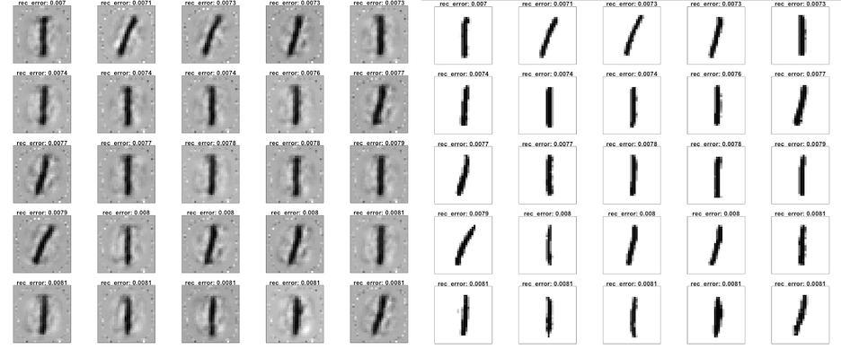

# Anomaly Detection on MNIST with H2O Deep Learning

######This tutorial shows how a Deep Learning [Auto-Encoder](http://en.wikipedia.org/wiki/Autoencoder) model can be used to find outliers in a dataset. This file is both valid R and markdown code. We use the well-known [MNIST](http://yann.lecun.com/exdb/mnist/) dataset of hand-written digits, where each row contains the 28^2=784 raw gray-scale pixel values from 0 to 255 of the digitized digits (0 to 9). 

### Start H2O and load the MNIST data

######Initialize the H2O server and import the MNIST training/testing datasets.

    library(h2o)
    h2oServer <- h2o.init()
    homedir <- paste0(path.expand("~"),"/h2o/") #modify if needed
    TRAIN = "smalldata/mnist/train.csv.gz"
    TEST = "smalldata/mnist/test.csv.gz"
    train_hex <- h2o.importFile(h2oServer, path = paste0(homedir,TRAIN), header = F, sep = ',', key = 'train.hex')
    test_hex <- h2o.importFile(h2oServer, path = paste0(homedir,TEST), header = F, sep = ',', key = 'test.hex')
 
######The data consists of 784 (=28^2) pixel values per row, with (gray-scale) values from 0 to 255. The last column is the response (a label in 0,1,2,...,9).
 
    predictors = c(1:784)
    resp = 785

######We do unsupervised training, so we can drop the response column.

    train_hex <- train_hex[,-resp]
    test_hex <- test_hex[,-resp]

### Finding outliers - ugly hand-written digits
######We train a Deep Learning Auto-Encoder to learn a compressed (low-dimensional) non-linear representation of the dataset, hence learning the intrinsic structure of the training dataset. The auto-encoder model is then used to transform all test set images to their reconstructed images, by passing through the lower-dimensional neural network. We then find outliers in a test dataset by comparing the reconstruction of each scanned digit with its original pixel values. The idea is that a high reconstruction error of a digit indicates that the test set point doesn't conform to the structure of the training data and can hence be called an outlier.

####1. Learn what's *normal* from the training data

######Train unsupervised Deep Learning autoencoder model on the training dataset. For simplicity, we train a model with 1 hidden layer of 50 Tanh neurons (should be less than 784 for it to compress), and train for 1 epoch (one pass over the data). We explicitly include constant columns (all white background) for the visualization to be easier.

    ae_model <- h2o.deeplearning(x=predictors,
                               y=42, #response (ignored - pick any non-constant column)
                               data=train_hex,
                               activation="Tanh",
                               autoencoder=T,
                               hidden=c(50),
                               ignore_const_cols=F,
                               epochs=1)
######Note that the response column is ignored (it is only required because of a shared DeepLearning code framework).
  
####2. Find outliers in the test data
######The Anomaly app computes the per-row reconstruction error for the test data set. It passes it through the autoencoder model (built on the training data) and computes mean square error (MSE) for each row in the test set.
 
    test_rec_error <- as.data.frame(h2o.anomaly(test_hex, ae_model))
      

######In case you wanted to see the lower-dimensional features created by the auto-encoder deep learning model, here's a way to extract them for a given dataset. This a non-linear dimensionality reduction, similar to PCA, but the values are capped by the activation function (in this case, they range from -1...1)

    test_features_deep <- h2o.deepfeatures(test_hex, ae_model, layer=1)
    summary(test_features_deep)

####3. Visualize the *good*, the *bad* and the *ugly*
######We will need a helper function for plotting handwritten digits (adapted from http://www.r-bloggers.com/the-essence-of-a-handwritten-digit/)
 
    source("helper.R")
  
######Let's look at the test set points with low/median/high reconstruction errors. We will now visualize the original test set points and their reconstructions obtained by propagating them through the narrow neural net.
  
    test_recon <- h2o.predict(ae_model, test_hex)
  
####The good
######Let's plot the 25 digits with lowest reconstruction error. First we plot the reconstruction, then the original scanned images.
    
    plotDigits(test_recon, test_rec_error, c(1:25))
    plotDigits(test_hex,   test_rec_error, c(1:25))

#####
######Clearly, a well-written digit 1 appears in both the training and testing set, and is easy to reconstruct by the autoencoder with minimal reconstruction error. Nothing is as easy as a straight line.

####The bad
######Now let's look at the 25 digits with median reconstruction error.
   
    plotDigits(test_recon, test_rec_error, c(4988:5012))
    plotDigits(test_hex,   test_rec_error, c(4988:5012))

#####
######These test set digits look "normal" - it is plausible that they resemble digits from the training data to a large extent, but they do have some particularities that cause some reconstruction error.

####The ugly
######And here are the biggest outliers - The 25 digits with highest reconstruction error!

    plotDigits(test_recon, test_rec_error, c(9976:10000))
    plotDigits(test_hex,   test_rec_error, c(9976:10000))

#####
######Now here are some pretty ugly digits that are plausibly not commonly found in the training data - some are even hard to classify by humans.

###Voila!
#####We were able to find outliers with H2O Deep Learning Auto-Encoder models. We would love to hear your usecase for Anomaly detection.

######*Note:* Every run of DeepLearning results in different results since we use [Hogwild!](http://www.eecs.berkeley.edu/~brecht/papers/hogwildTR.pdf) parallelization with intentional race conditions between threads.  To get reproducible results at the expense of speed for small datasets, set reproducible=T and specify a seed.

#### More information can be found in the [H2O Deep Learning booklet](https://t.co/kWzyFMGJ2S) and in our [slides](http://www.slideshare.net/0xdata/presentations).

### Appendix: Helper code
######For those interested, here's the helper code to visualize the digits. Inspired by [r-bloggers](http://www.r-bloggers.com/the-essence-of-a-handwritten-digit/).

	 plotDigit <- function(mydata, rec_error) {
	   len<-nrow(mydata)
	   N<-ceiling(sqrt(len))
	   par(mfrow=c(N,N),pty='s',mar=c(1,1,1,1),xaxt='n',yaxt='n')
        for (i in 1:nrow(mydata)) {
        colors<-c('white','black')
        cus_col<-colorRampPalette(colors=colors)
        z<-array(mydata[i,],dim=c(28,28))
        z<-z[,28:1]
        image(1:28,1:28,z,main=paste0("rec_error: ", round(rec_error[i],4)),col=cus_col(256))
      }
    }

    plotDigits <- function(data, rec_error, rows) {
       row_idx <- order(rec_error[,1],decreasing=F)[rows]
       my_rec_error <- rec_error[row_idx,]
       my_data <- as.matrix(as.data.frame(data[row_idx,]))
       plotDigit(my_data, my_rec_error)
    }