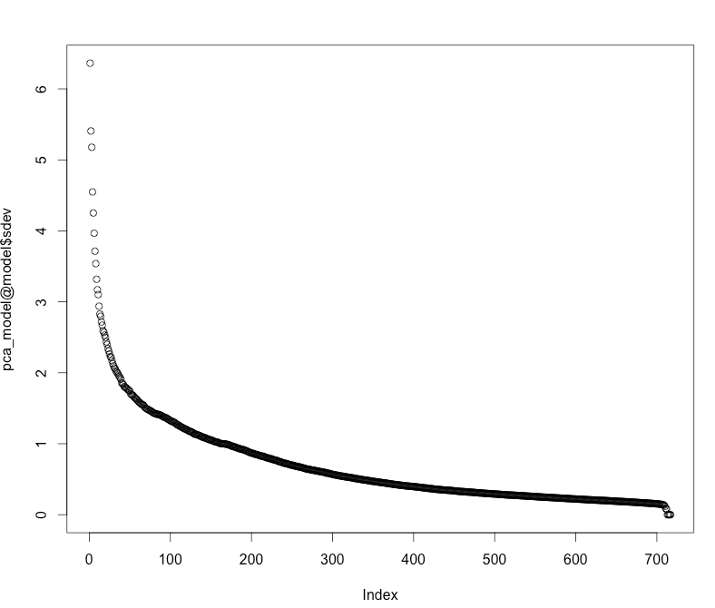

# Dimensionality Reduction of MNIST

######This tutorial shows how to reduce the dimensionality of a dataset with H2O. We will use both PCA and Deep Learning. This file is both valid R and markdown code. We use the well-known [MNIST](http://yann.lecun.com/exdb/mnist/) dataset of hand-written digits, where each row contains the 28^2=784 raw gray-scale pixel values from 0 to 255 of the digitized digits (0 to 9). 

### Start H2O and load the MNIST data

######Initialize the H2O server and import the MNIST training/testing datasets.

    library(h2o)
    h2oServer <- h2o.init(nthreads=-1)
    homedir <- paste0(path.expand("~"),"/h2o/") #modify if needed
    DATA = "smalldata/mnist/train.csv.gz"
    data_hex <- h2o.importFile(h2oServer, path = paste0(homedir,DATA), header = F, sep = ',', key = 'train.hex')
    
######The data consists of 784 (=28^2) pixel values per row, with (gray-scale) values from 0 to 255. The last column is the response (a label in 0,1,2,...,9).
 
    predictors = c(1:784)
    resp = 785

######We do unsupervised training, so we can drop the response column.

    data_hex <- data_hex[,-resp]

### PCA - Principle Components Analysis

###### Let's compute at the principal components of the MNIST data, and plot the standard deviations of the principal components (i.e., the square roots of the eigenvalues of the covariance/correlation matrix).

    pca_model <- h2o.prcomp(data_hex)
    plot(pca_model@model$sdev)

#####
    
###### To reduce the dimensionality of MNIST to its 50 principal components, we use the h2o.predict() function with an extra argument `num_pc`:

    features_pca <- h2o.predict(pca_model, data_hex, num_pc=50)
    summary(features_pca)
   
### Deep Learning Autoencoder

    ae_model <- h2o.deeplearning(x=predictors,
                                y=42, #ignored (pick any non-constant predictor)
                                data_hex,
                                activation="Tanh",
                                autoencoder=T,
                                hidden=c(100,50,100),
                                epochs=1,
                                ignore_const_cols = F)
    
###### We can now convert the data with the autoencoder model to 50-dimensional space (second hidden layer)

    features_ae <- h2o.deepfeatures(data_hex, ae_model, layer=2)
    summary(features_ae)

###### To get the full reconstruction from the output layer of the autoencoder, use h2o.predict() as follows

    data_reconstr <- h2o.predict(ae_model, data_hex)
    summary(data_reconstr)
